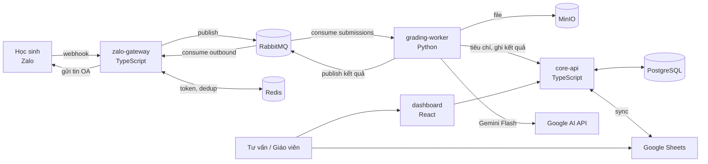
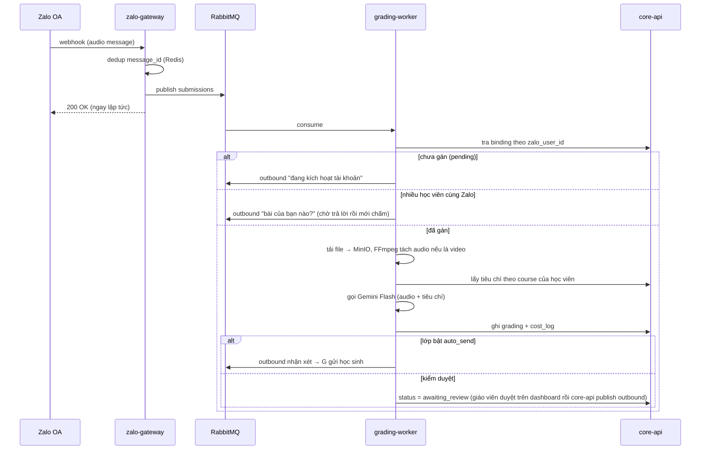

# Kiến trúc Microservices — Bot chữa bài Zalo OA (ILM)

**Ngày:** 2026-07-19 · **Phiên bản:** 1.0 · **Trạng thái:** Đề xuất chờ duyệt

Tài liệu này (1) đánh giá có hệ thống hai tài liệu nền tảng `Foundation.md` và `UpdateFoundation.md`, (2) nêu các điểm tranh luận kèm phán quyết, và (3) chốt một bản kiến trúc thiết kế chi tiết để tự build bằng Claude Code, stack TypeScript + Python, vận hành trên một VPS.

**Quyết định nền:** đi theo hướng microservices của `UpdateFoundation.md`, nhưng giữ nguyên vẹn toàn bộ phạm vi sản phẩm và ranh giới nghiệp vụ của `Foundation.md`.

---

## Phần 1 — Đánh giá có hệ thống hai tài liệu

### 1.1. Ma trận so sánh

| Tiêu chí | Foundation (n8n + Sheets) | UpdateFoundation (Microservices) |
| :---- | :---- | :---- |
| Độ tin cậy (không mất bài) | Yếu — webhook xử lý đồng bộ, không hàng đợi; n8n lỗi giữa chừng là mất bài | Mạnh — RabbitMQ ack/nack + Dead Letter Queue, bài lỗi được giữ lại thử lại |
| Toàn vẹn dữ liệu | Yếu — Sheets không ràng buộc, key khóa lệch một dấu cách là gãy; race condition khi ghi song song | Mạnh — PostgreSQL với khóa ngoại, ràng buộc, transaction |
| Chống trùng (Zalo bắn lại) | Có nêu (theo message_id) nhưng tự cài trong workflow, dễ sót | Không nêu rõ — phải bổ sung (mục 3.5) |
| Refresh token (~1 giờ) | Có nêu rõ, có template | Chỉ nói "Redis lưu token" — phải thiết kế lại chi tiết (mục 3.6) |
| Kiểm duyệt AI trước khi gửi | Không có — AI trả thẳng cho học sinh | Có manual override — điểm cộng lớn, tránh AI ảo giác |
| Chi phí hạ tầng | ~120–250k/tháng (VPS) hoặc n8n Cloud ~500–650k | ~250–400k/tháng (VPS 4GB chạy đủ stack) |
| Thời gian xây | 2–4 tuần (freelancer) | 2–3 tháng (tự build với Claude Code) |
| Khả năng test/version | Yếu — workflow n8n khó diff, khó viết test tự động | Mạnh — code trong git, unit/integration test được |
| Khả năng mở rộng | Đủ cho 500 HS về tải, nhưng Sheets là nút cổ chai vận hành | Thừa cho 500 HS (~100 bài/ngày là tải rất nhỏ) |
| Vận hành một người | Dễ (giao diện n8n kéo thả) | Khó hơn — 4 service + 4 hạ tầng, cần dashboard giám sát tốt |
| Nghiệp vụ & phạm vi | Rất rõ: ranh giới bot, onboarding, báo chưa nộp, phân vai, pilot | Gần như không nói — chỉ nói kỹ thuật |

### 1.2. Kết luận đánh giá

- `Foundation.md` là tài liệu **sản phẩm** tốt: phạm vi, ranh giới, luồng nghiệp vụ, phân vai, kế hoạch pilot đều dùng lại được nguyên vẹn. Kiến trúc kỹ thuật của nó (Sheets làm DB, xử lý đồng bộ) là phần yếu.
- `UpdateFoundation.md` là tài liệu **kỹ thuật** tốt: giải đúng các điểm gãy của bản 1.0 (mất bài, toàn vẹn dữ liệu, không kiểm duyệt). Điểm yếu là bỏ trống nghiệp vụ, thừa độ phức tạp ở vài chỗ (gRPC, tách quá nhiều service phụ trợ), và thiếu vài chi tiết sống còn mà Foundation đã nêu (dedup, token, khung 48h).
- **Bản chốt = phạm vi & nghiệp vụ của Foundation + xương sống kỹ thuật của UpdateFoundation, cắt gọn chỗ thừa, vá chỗ thiếu.**

---

## Phần 2 — Các điểm tranh luận & phán quyết

### Tranh luận 1: Microservices hay modular monolith ở tải ~100 bài/ngày?

- **Phía monolith:** 500 HS × ~5 bài/tuần ≈ 100–150 bài/ngày, dồn vào vài khung giờ tối — một tiến trình Node đơn cũng xử lý dư. Microservices nghĩa là nhiều repo/dịch vụ để deploy, log rải rác, lỗi mạng nội bộ, một người vận hành sẽ mệt.
- **Phía microservices:** phần chấm AI (tải file, FFmpeg, gọi Gemini 30–90 giây/bài) là tải **nặng và hay hỏng**, tách riêng nó khỏi phần nhận webhook (phải trả lời trong mili-giây) là tách đúng ranh giới chịu lỗi. Python mạnh về AI/media, TypeScript mạnh về API/dashboard — đa ngôn ngữ tự nó đòi tách tiến trình.
- **Phán quyết:** đi microservices theo yêu cầu, nhưng ở dạng **"microservices-lite"**: đúng 4 service (không phải 6–8 như UpdateFoundation gợi ý), tất cả trong một `docker-compose` trên một VPS, một repo monorepo, giao tiếp nội bộ bằng **REST + RabbitMQ, bỏ gRPC** (gRPC không mua được gì ở tải này ngoài độ phức tạp). Media Processing và Blob Storage không tách thành service riêng — FFmpeg nằm trong grading-worker, MinIO là hạ tầng dùng chung. Chỉ tách thêm khi có điểm đau thật.

### Tranh luận 2: Google Sheets là nguồn sự thật hay chỉ là kênh nhập liệu?

- **Phía Sheets:** tư vấn đã quen Sheets, sửa trực tiếp, không cần học dashboard mới.
- **Phía Postgres:** hai nguồn sự thật là công thức của lỗi lệch dữ liệu; Sheets không có ràng buộc nên lỗi key khóa của Foundation sẽ quay lại.
- **Phán quyết:** **PostgreSQL là nguồn sự thật duy nhất.** Sheets giữ vai trò kênh nhập liệu quen tay cho tư vấn: cron sync một chiều Sheets → Postgres (15 phút/lần), có màn hình "trạng thái đồng bộ" báo dòng lỗi (SĐT sai định dạng, key khóa không khớp) thay vì im lặng nuốt lỗi. Về lâu dài, nhập liệu chuyển dần sang dashboard và Sheets được nghỉ hưu.

### Tranh luận 3: RabbitMQ hay BullMQ (Redis)?

- **Phía BullMQ:** đã có Redis trong stack, dùng BullMQ là bớt được một thành phần phải vận hành; Bull Board có sẵn UI.
- **Phía RabbitMQ:** ack/nack + DLQ + redelivery là ngữ nghĩa hàng đợi đúng chuẩn mà UpdateFoundation đặt làm xương sống; consumer Python (grading-worker) và TypeScript (gateway) cùng nói AMQP tự nhiên hơn là cùng thao tác cấu trúc Redis của BullMQ (BullMQ là thư viện Node, phía Python hỗ trợ kém).
- **Phán quyết:** **RabbitMQ**, chính vì stack đa ngôn ngữ TS + Python. Đây là điểm mà lựa chọn stack quyết định lựa chọn hạ tầng.

### Tranh luận 4: Kiểm duyệt thủ công trước khi gửi — bật hay tắt?

- **Phía tắt:** kiểm duyệt từng bài làm mất tính "tự động hóa", giáo viên thành nút cổ chai, phản hồi chậm khiến học sinh mất hứng.
- **Phía bật:** AI ảo giác một lần với phụ huynh khó tính là mất uy tín trung tâm; giai đoạn pilot chưa đo được chất lượng chấm.
- **Phán quyết:** cấu hình **theo lớp** (`auto_send` per class). Pilot: bật kiểm duyệt 100% để giáo viên hiệu chỉnh prompt/tiêu chí. Khi tỷ lệ sửa nhận xét < ~5% trong 2 tuần liên tiếp, bật auto-send cho lớp đó, chuyển giáo viên sang kiểm mẫu xác suất (spot-check). Cơ chế này nằm sẵn trong schema từ ngày đầu để không phải đập luồng sau này.

### Tranh luận 5: Nghiệp vụ Foundation phải sống nguyên vẹn

Không phải tranh luận kỹ thuật mà là điều kiện nghiệm thu: kiến trúc mới **bắt buộc** giữ đủ các quy tắc sau của Foundation, và Phần 3 phải chỉ được chỗ mỗi quy tắc sống ở đâu:

| Quy tắc (Foundation) | Sống ở đâu trong bản chốt |
| :---- | :---- |
| Bot chỉ nói chuyện học thuật với học sinh | Classifier trong grading-worker + bảng `flags`; tin ngoài học thuật KHÔNG sinh tin trả lời |
| Bot không nhắn phụ huynh, không nhắc nộp bài | Không tồn tại luồng gửi nào tới phụ huynh; báo chưa nộp chỉ gửi tư vấn |
| Onboarding qua SĐT do tư vấn điền (ChoGan) | Bảng `zalo_bindings` + màn hình onboarding trên dashboard (mục 3.4.2) |
| Một Zalo nhiều học viên (anh em chung máy) | `zalo_bindings` cho phép nhiều binding cùng `zalo_user_id`; bot hỏi "bài của bạn nào" |
| Báo chưa nộp cuối ngày, tôn trọng lịch giao bài | Cron trong core-api đọc `assignment_calendar` (mục 3.4.4) |
| Chống trùng message_id | Redis SETNX tại gateway (mục 3.5) |
| Token OA sống ~1 giờ | Job refresh trong gateway (mục 3.6) |
| Khung 48h miễn phí | Kiểm tra tại consumer gửi tin outbound (mục 3.5) |
| Giới hạn độ dài clip để ghìm chi phí | Grading-worker từ chối bài quá dài trước khi gọi Gemini + `cost_log` |

---

## Phần 3 — Kiến trúc chi tiết (bản chốt)

### 3.1. Sơ đồ tổng thể



### 3.2. Bốn service

| Service | Stack | Trách nhiệm | Không làm |
| :---- | :---- | :---- | :---- |
| **zalo-gateway** | TypeScript, NestJS | Nhận webhook Zalo, ACK 200 ngay (<100ms), dedup, publish vào RabbitMQ; consumer `outbound` gọi API gửi tin OA; job refresh token | Không xử lý nghiệp vụ, không đụng Postgres |
| **core-api** | TypeScript, NestJS | Nguồn sự thật nghiệp vụ: học viên, binding Zalo, tiêu chí, lịch giao bài, submissions/gradings, flags; cron sync Sheets; cron báo chưa nộp; REST API cho dashboard và worker; endpoint retry DLQ | Không gọi Zalo API, không gọi LLM |
| **grading-worker** | Python | Consume `submissions`: tải file từ Zalo → MinIO, FFmpeg tách audio, phân loại tin text (học thuật/ngoài học thuật), lấy tiêu chí từ core-api, gọi Gemini, ghi kết quả về core-api, publish tin trả lời (hoặc chờ duyệt) | Không tự gửi tin cho học sinh — mọi tin ra đều qua queue `outbound` |
| **dashboard** | React + Vite (SPA tĩnh, Caddy serve) | 5 phân hệ (mục 3.7); gọi core-api | Không có backend riêng — core-api là backend |

Cấu trúc monorepo:

```
/services
  /zalo-gateway     (NestJS)
  /core-api         (NestJS)
  /grading-worker   (Python)
  /dashboard        (React)
/infra
  docker-compose.yml, Caddyfile, .env.example
/docs               (tài liệu, trong đó có file này)
```

### 3.3. Hạ tầng & triển khai

- **1 VPS Ubuntu 4GB RAM** (~250–400k/tháng). Toàn bộ chạy `docker-compose`: 4 service + PostgreSQL 16 + Redis 7 + RabbitMQ 3 (bật management UI) + MinIO + Caddy.
- **Caddy**: HTTPS tự động cho `n8n.ilm.edu.vn` (hoặc subdomain mới, ví dụ `bot.ilm.edu.vn`) → reverse proxy: `/webhook` → gateway, `/api` → core-api, `/` → dashboard, `/rabbitmq` → RabbitMQ UI (basic auth).
- **IP Access của app Zalo = IP VPS** (giữ nguyên yêu cầu Foundation).
- **Secrets** (App ID/Secret Zalo, khóa Gemini, mật khẩu DB) nằm trong `.env` trên VPS, không commit, không nằm trong Sheet.
- **Backup:** `pg_dump` hằng đêm + sync MinIO ra ngoài VPS (tuần đầu có thể chỉ pg_dump; file bài nộp mất được, dữ liệu chấm thì không).

### 3.4. Mô hình dữ liệu (PostgreSQL)

Thay thế 5 tab Sheets của Foundation bằng ràng buộc thật. Khóa ngoại thay cho "dropdown phải khớp tuyệt đối":

```sql
courses         (id PK, key UNIQUE,           -- 'basic', 'ielts50'…
                 band_desc, is_active)
criteria        (id PK, course_id FK→courses, title,
                 body_text,                    -- bóc từ .docx, plain text
                 source_filename, version, created_at)
students        (id PK, code UNIQUE,           -- mã HV
                 full_name, phone, course_id FK→courses,
                 class_name, campus, status,   -- 'active'/'paused'…
                 synced_from_sheet_at)
zalo_bindings   (id PK, zalo_user_id, student_id FK→students NULL,
                 display_name, status,         -- 'pending'|'active'
                 phone_entered, created_at)
                 -- status='pending' ⇔ tab ChoGan cũ; nhiều dòng cùng
                 -- zalo_user_id = một Zalo nhiều học viên
assignment_calendar (date PK, note)            -- ngày có giao bài
submissions     (id PK, message_id UNIQUE,     -- idempotency
                 zalo_user_id, student_id FK NULL,
                 kind,                         -- 'audio'|'video'|'text_academic'|'text_other'
                 media_url_zalo, media_key_minio,
                 duration_sec, status,
                 -- 'received'|'processing'|'graded'|'awaiting_review'
                 -- |'sent'|'failed'
                 received_at)
gradings        (id PK, submission_id FK UNIQUE, criteria_id FK,
                 llm_feedback, reviewed_feedback NULL,
                 reviewed_by NULL, auto_sent BOOL, sent_at)
flags           (id PK, submission_id FK, reason, -- 'ngoài học thuật'
                 assigned_advisor, resolved_at NULL)
classes_config  (class_name PK, advisor_zalo_id, auto_send BOOL DEFAULT false)
outbound_log    (id PK, zalo_user_id, payload, status, error, sent_at)
cost_log        (id PK, submission_id FK NULL, model,
                 input_tokens, output_tokens, est_usd, created_at)
sheet_sync_log  (id PK, run_at, rows_ok, rows_error, error_detail JSONB)
```

### 3.5. Hàng đợi & xử lý lỗi (RabbitMQ)

Topology: 1 exchange `ilm.direct`, 2 queue chính, mỗi queue một DLQ:

| Queue | Producer → Consumer | Nội dung |
| :---- | :---- | :---- |
| `submissions` | gateway → grading-worker | Tin mới từ học sinh (mọi loại, worker tự rẽ nhánh) |
| `outbound` | worker/core-api → gateway | Tin cần gửi cho học sinh hoặc tư vấn qua OA |
| `submissions.dlq`, `outbound.dlq` | tự động khi quá số lần retry | Bài/tin lỗi chờ xử lý tay |

Quy tắc:

- **Idempotency:** gateway `SETNX dedup:{message_id}` (TTL 7 ngày) trước khi publish — Zalo bắn lại thì bỏ qua. `submissions.message_id UNIQUE` là lưới đỡ thứ hai.
- **Retry:** worker nack khi lỗi tạm (Gemini timeout/5xx, tải file lỗi); retry 3 lần với backoff (30s/2ph/10ph qua delayed-retry queue có TTL); quá 3 lần → DLQ. Dashboard có nút Retry đẩy lại từ DLQ.
- **Khung 48h:** consumer `outbound` kiểm tra thời điểm tin nhắn cuối của user (Redis); nếu sắp/đã quá 48h → không gửi tự động, ghi `outbound_log.status='blocked_48h'` và báo tư vấn xử lý tay. Không bao giờ âm thầm phát sinh phí.
- **Bài quá dài:** worker đọc duration trước khi gọi Gemini; quá ngưỡng (cấu hình, mặc định 7 phút) → không chấm, gửi tin đề nghị học sinh gửi lại clip ngắn hơn. Đây là van chi phí chính.

### 3.6. Các luồng chính

**Luồng nộp bài (audio/video):**



**Onboarding (giữ nguyên luồng ChoGan):** học sinh nhắn lần đầu → worker thấy `zalo_user_id` chưa có binding active → tạo `zalo_bindings(status='pending')` + outbound "đang kích hoạt, em chờ chút" → tư vấn mở dashboard (màn Onboarding), điền SĐT → core-api đối chiếu `students.phone`, gán `student_id`, đổi status='active' → publish outbound "đã kích hoạt xong".

**Text học thuật / ngoài học thuật:** worker phân loại (Gemini, prompt phân loại rẻ) → học thuật: trả lời theo tài liệu trung tâm (đi qua cùng cơ chế auto_send/kiểm duyệt) → ngoài học thuật: ghi `flags` + outbound cho **tư vấn** (không phải học sinh); học sinh không nhận được gì từ bot.

**Báo chưa nộp cuối ngày:** cron core-api 20:30 → hôm nay có trong `assignment_calendar`? → không: dừng; có: students active theo lớp TRỪ submissions hôm nay → gom theo lớp → outbound tới `classes_config.advisor_zalo_id`. Không nhắn học sinh, không nhắn phụ huynh.

**Refresh token:** job trong gateway chạy mỗi 50 phút, dùng `refresh_token` (OAuth v4) xin cặp token mới, ghi Redis (`zalo:access_token`, `zalo:refresh_token` — refresh_token là loại dùng-một-lần nên ghi phải atomic), retry + cảnh báo tư vấn/IT nếu refresh thất bại 2 lần liên tiếp (bot sắp chết).

**Sync Google Sheets:** cron core-api 15 phút/lần đọc tab DanhSach → upsert `students` theo `code`; dòng lỗi (SĐT sai, key khóa không có trong `courses`) ghi `sheet_sync_log` và hiện đỏ trên dashboard — không nuốt lỗi im lặng.

### 3.7. Dashboard (5 phân hệ — theo UpdateFoundation, cắt gọn)

1. **Giám sát hệ thống:** độ sâu các queue (đọc RabbitMQ management API), danh sách DLQ với nguyên nhân lỗi + nút Retry, trạng thái token Zalo, lần sync Sheets cuối.
2. **Học viên:** danh sách/tìm kiếm, sửa tay, màn **Onboarding** (bindings pending chờ điền SĐT), lỗi sync Sheets.
3. **Theo dõi bài nộp:** bảng trạng thái theo luồng `received → processing → graded/awaiting_review → sent/failed`; xem chi tiết có player audio (file từ MinIO); màn **Kiểm duyệt** — sửa nhận xét AI rồi bấm gửi.
4. **Báo cáo & chi phí:** tỷ lệ nộp đúng hạn theo lớp, danh sách hay vắng, chi phí Gemini theo ngày/tháng từ `cost_log`, xuất Excel.
5. **Tiêu chí & Prompt:** upload .docx (core-api bóc text bằng `mammoth`, có preview xác nhận trước khi lưu), quản lý system prompt + temperature theo khóa, bật/tắt `auto_send` theo lớp.

Phân quyền tối giản 2 vai trò: `admin` (IT — thấy hết) và `staff` (tư vấn/giáo viên — phân hệ 2/3/4/5). Đăng nhập session đơn giản, chưa cần SSO.

### 3.8. Những thứ cố ý KHÔNG làm (YAGNI)

- gRPC, GraphQL, Kubernetes, service mesh, multi-VPS — thừa ở tải này.
- Media Processing Service và Blob Service riêng — FFmpeg sống trong worker, MinIO là hạ tầng.
- Notification Service riêng — cảnh báo (queue tồn, token chết, DLQ đầy) là cron nhỏ trong core-api gửi qua chính OA/Telegram.
- Chấm phát âm âm vị (Speechace/ELSA/Azure) — để sau pilot, đúng khuyến nghị Foundation.
- Bot nhắn phụ huynh, nhắc nộp bài — vĩnh viễn ngoài phạm vi giai đoạn này (ranh giới Foundation).

---

## Phần 4 — Lộ trình build & rủi ro

Lộ trình cho một người tự build với Claude Code; mỗi milestone chạy được thật và có thể dừng lại nghiệm thu:

| # | Milestone | Nội dung | Tiêu chí xong |
| :---- | :---- | :---- | :---- |
| 1 | Hạ tầng + Gateway | docker-compose đủ stack; gateway nhận webhook, dedup, refresh token, echo được tin | Nhắn OA → bot echo lại; token tự làm mới qua đêm không chết |
| 2 | Core-api + dữ liệu | Schema Postgres, sync Sheets, onboarding ChoGan, API nội bộ | HS mới nhắn lần đầu → pending → tư vấn điền SĐT → kích hoạt |
| 3 | Grading-worker | Tải file, FFmpeg, gọi Gemini, ghi kết quả, DLQ hoạt động | 1 clip thật 5 phút được chấm end-to-end, lỗi Gemini vào DLQ và retry được |
| 4 | Dashboard | 5 phân hệ, kiểm duyệt, báo chưa nộp cuối ngày | Giáo viên duyệt 1 bài trên dashboard → HS nhận nhận xét; 20:30 tư vấn nhận danh sách chưa nộp |
| 5 | Pilot | 1–2 lớp, 2–4 tuần (giữ nguyên tinh thần Foundation) | Đo được: chi phí Gemini/HS/ngày, tỷ lệ giáo viên phải sửa nhận xét, tỷ lệ gán nhầm onboarding |

Rủi ro chính:

| Rủi ro | Mức | Giảm thiểu |
| :---- | :---- | :---- |
| Chi phí Gemini tăng theo HS | Cao | Van giới hạn độ dài clip + `cost_log` + cảnh báo ngưỡng ngày; pilot đo trước khi mở rộng |
| Chất lượng nhận xét AI | Cao | Kiểm duyệt 100% giai đoạn đầu, auto_send theo lớp chỉ khi tỷ lệ sửa <5% |
| Gán nhầm onboarding | Vừa | Đối chiếu SĐT + màn hình xác nhận; đo tỷ lệ trong pilot |
| Một người vận hành 8 container | Vừa | docker-compose restart policy, phân hệ giám sát, cảnh báo tự động qua OA/Telegram |
| Refresh token thất bại (bot chết sau ~1h) | Vừa | Retry + cảnh báo sau 2 lần lỗi; runbook khôi phục tay ghi trong README hạ tầng |
| Zalo đổi API/chính sách webhook | Thấp | Mọi tiếp xúc Zalo cô lập trong gateway — chỉ sửa một chỗ |

---

*Hết. Tài liệu này thay thế phần kiến trúc của `Foundation.md` và cụ thể hóa `UpdateFoundation.md`; phạm vi sản phẩm và ranh giới nghiệp vụ trong `Foundation.md` mục 1 & 3 vẫn giữ nguyên hiệu lực.*
