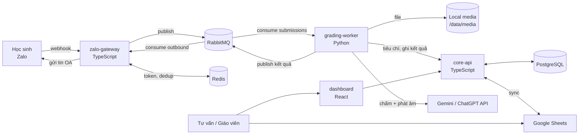
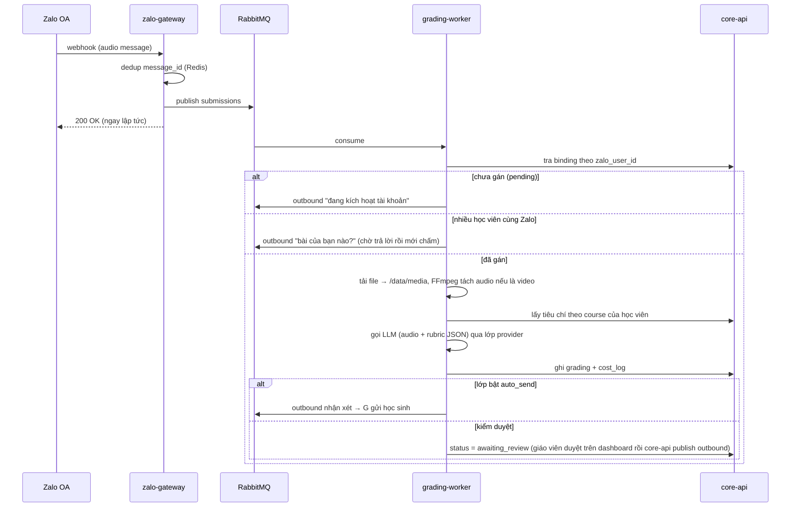

# Kiến trúc Microservices — Bot chữa bài Zalo OA (ILM)

**Ngày:** 2026-07-19 · **Phiên bản:** 1.5 · **Trạng thái:** Đã duyệt, đang triển khai (M1 + M2 + M3 + M4 xong)

**Changelog v1.5 (2026-07-22, quyết định triển khai trong lúc build M4 — dashboard):**
1. **Xuất báo cáo (mục 3.7 phân hệ 4): cả CSV lẫn `.xlsx` thật**, không chỉ một trong hai — quyết định của chủ dự án. `.xlsx` qua `exceljs` (dependency mới); CSV thủ công (không đáng thêm dependency cho việc đơn giản này). Cả hai định dạng dùng chung dữ liệu từ `reports/reports.service.ts`.
2. **Bóc `.docx` rubric (mục 3.9) qua `mammoth.convertToHtml` + parser heading tự viết** (`criteria/docx-parser.ts`), không dùng `extractRawText` (mất hết cấu trúc heading, không phân biệt được 4 mục bắt buộc). Vì chưa có mẫu `.docx` thật nào tồn tại trước đó, một mini-format cố định được định nghĩa cho từng heading (key:value cho "Thông tin chung"/"Giọng điệu", `tên (trọng số N): band=mô_tả; ...` cho "Tiêu chí") — đủ chặt để parse tự động, đủ đơn giản để giáo viên viết tay trong Word. File mẫu `templates/rubric-template.docx` được sinh bằng script dùng package `docx` (`scripts/generate-rubric-template.ts`), và chính là fixture cho smoke test — đã upload thật qua mammoth và ra đúng rubric JSON.
3. **`classes_config` có bảng từ M2 nhưng chưa có API cho tới M4** — bổ sung `classes-config/` module (`GET`/`PUT`) để màn Tiêu chí & Prompt bật/tắt `auto_send` theo lớp.
4. **Dashboard được container hóa lần đầu** — build stage chạy `npm run build` rồi copy `dist/` vào volume dùng chung với Caddy và tự thoát (không cần Node/nginx chạy nền); Caddy tự file_server + SPA fallback. Đây là việc `infra/Caddyfile` đã chừa chỗ từ M1 ("M4: dashboard SPA sẽ được serve ở đây").
5. **Không chạy Node.js trực tiếp trên máy dev** (yêu cầu chủ dự án giữa chừng M4) — mọi build/test TS/JS từ nay qua Docker (`docker run node:24-alpine ...` cho test, `docker compose build` cho compile check), test suite chạy với `--maxWorkers=2` nếu máy dev giới hạn RAM cho Docker Desktop (đã gặp OOM kill một worker jest khi chạy đủ song song cạnh tranh với cả stack 7 container đang chạy).

**Changelog v1.4 (2026-07-20, quyết định triển khai trong lúc build M3 — grading-worker):**
1. **Hàng đợi Python: `aio-pika` (async), không phải `pika` (blocking)** — lượt chấm mất 30–90 giây (như tài liệu đã ước tính ở mục 3.1); event loop async giữ được nhịp heartbeat AMQP trong lúc chờ LLM trả lời, còn `pika.BlockingConnection` cần tự gọi `process_data_events()` để không bị broker ngắt kết nối giữa chừng.
2. **SDK Gemini đã đổi so với kiến thức nền lúc viết tài liệu**: mục 3.9 giả định kiểu gọi cũ (`generate_content`). Xác minh qua tài liệu trực tuyến ngày 2026-07-20: SDK hiện tại là `google-genai` (`from google import genai`), gọi qua `client.interactions.create(model=..., system_instruction=..., input=[...], response_format={...}, generation_config={"temperature": ...})`. Nếu SDK đổi tiếp trước khi có API key thật để nghiệm thu, chỉ cần sửa `grading-worker/src/grading_worker/grading/providers/gemini.py`.
3. **JSON Schema đầu ra dùng CHUNG cho cả gửi request lẫn validate response** (`grading/schema.py`, xây động từ `dimensions` trong rubric — không dùng Pydantic tĩnh vì rubric không cố định ở compile-time). `pronunciation` bắt buộc: rubric thiếu dimension này bị từ chối chấm ngay, không chỉ "bị từ chối khi upload" như mục 3.10 dự kiến (upload validation vẫn là việc của M4.6, đây là lớp phòng thủ thứ hai ở worker).
4. **`POST /internal/submissions` (M2) đổi từ `create` thuần sang upsert theo `messageId`** — phát hiện khi xây pipeline worker: nếu message bị RabbitMQ redeliver/retry sau khi submission đã được tạo, gọi lại `create` sẽ vỡ vì unique constraint. `message_id UNIQUE` (mục 3.5, "lưới đỡ thứ hai") giờ mới thực sự phát huy tác dụng chống trùng ở lớp ghi dữ liệu.
5. **2 endpoint nội bộ mới** không có trong thiết kế M2 gốc, cần cho pipeline worker: `PATCH /internal/submissions/:id` (cập nhật trạng thái theo tiến trình) và `GET /internal/students/:id` (trả `course.llmConfig` + `classes_config.autoSend` — worker cần cả hai để chọn provider và rẽ nhánh gửi tự động, mục Tranh luận 4).
6. **M3.6 (vòng đời xóa media) dời sau M3.7**: không có gì để xóa cho tới khi có ít nhất một lượt chấm thật ghi file — xây cron xóa trước khi xác nhận đường ghi hoạt động là làm ngược.

**Changelog v1.3 (2026-07-20, quyết định triển khai trong lúc build M2 — core-api):**
1. **DB layer: Prisma** (schema + `prisma migrate`), không phải raw SQL/query builder — khác với phong cách không-ORM của zalo-gateway, vì core-api là service DUY NHẤT chạm 12 bảng ở mục 3.4 (có FK/JSONB), không service nào khác connect thẳng Postgres.
2. **Bổ sung bảng `dashboard_users`** vào mục 3.4 (không có trong bản v1.2): `id, email UNIQUE, password_hash, role admin|staff, created_at` — cần cho quyết định #3 dưới đây. Tài khoản admin đầu tiên tạo qua env var lúc khởi động (không có màn đăng ký).
3. **Session auth thật ngay từ M2**, không đợi đến M4: `express-session` + `connect-redis`, bcrypt, 2 role admin/staff đúng theo mục 3.7 — thay vì API key tạm/không auth cho tới khi dashboard xong.
4. **Kéo sớm một lát cắt dashboard từ M4**: `services/dashboard` (React + Vite + react-i18next vi/en) với đúng 3 màn Login, Cấu hình hệ thống (mục 3.3/3.7), Onboarding (mục 3.6) — đủ để nghiệm thu M2 có giao diện thật, không chỉ qua curl. 4 phân hệ còn lại (theo dõi bài nộp, kiểm duyệt, báo cáo & chi phí, tiêu chí & prompt) vẫn ở M4. Dashboard này CHƯA vào `docker-compose`/Caddy — chạy qua `npm run dev`, việc container hóa đầy đủ vẫn là việc của M4 khi cả 5 phân hệ đã có.
5. Điểm chưa khớp giữa mục 3.6 và thực tế build: sequence diagram cho onboarding có **grading-worker** là bên tạo `zalo_bindings(status='pending')` khi thấy `zalo_user_id` lạ — nhưng worker chỉ xây ở M3. M2 xây sẵn endpoint worker sẽ gọi (`POST /internal/bindings/ensure`) và nghiệm thu bằng cách gọi thẳng endpoint đó, không phải qua tin nhắn Zalo thật.

**Changelog v1.2:**
- Toàn bộ **cấu hình ứng dụng quản trị qua UI dashboard, không qua console/.env**: thông tin app Zalo (App ID/Secret/OA ID, token khởi tạo, webhook secret), khóa API LLM (Gemini/OpenAI), ngưỡng độ dài clip, bật/tắt guard 48h… lưu ở bảng `settings` (Postgres, core-api làm chủ), mirror sang Redis (`config:*` + pub/sub reload) cho gateway/worker đọc nóng. File `.env` chỉ còn secrets hạ tầng: Postgres, Redis, RabbitMQ, domain. Giá trị Zalo/LLM trong `.env` chỉ là fallback cho môi trường dev khi chưa có dashboard.

**Changelog v1.1 (phản hồi review của chủ dự án):**
1. Thu hẹp phạm vi bot: KHÔNG hội thoại với học sinh — chỉ nhận bài, xác minh danh tính học sinh, trả kết quả chấm (bỏ nhánh Q&A học thuật).
2. Chốt phương án lưu file audio/video **local trên VPS** (bỏ MinIO/cloud) kèm vòng đời lưu–sửa–xóa (mục 3.8, Tranh luận 6).
3. Bổ sung chuẩn hóa tiêu chí chấm bài (rubric JSON) + lớp trừu tượng LLM cho cả Gemini & ChatGPT (mục 3.9).
4. Bổ sung i18n Việt/Anh cho dashboard, tin hệ thống và nhận xét AI (mục 3.11).
5. Chấm phát âm chuyển từ "để sau" thành **yêu cầu bắt buộc**, do Gemini/ChatGPT chấm và phản hồi với đầu ra có cấu trúc — local chỉ dành cho lưu trữ, không chạy model AI local (mục 3.10, Tranh luận 7).

Tài liệu này (1) đánh giá có hệ thống hai tài liệu nền tảng `Foundation.md` và `UpdateFoundation.md`, (2) nêu các điểm tranh luận kèm phán quyết, và (3) chốt một bản kiến trúc thiết kế chi tiết để tự build bằng Claude Code, stack TypeScript + Python, vận hành trên một VPS.

**Quyết định nền:** đi theo hướng microservices của `UpdateFoundation.md`, nhưng giữ nguyên vẹn toàn bộ phạm vi sản phẩm và ranh giới nghiệp vụ của `Foundation.md`.

---

## Phần 1 — Đánh giá có hệ thống hai tài liệu

### 1.1. Ma trận so sánh

| Tiêu chí | Foundation (n8n + Sheets) | UpdateFoundation (Microservices) |
| :---- | :---- | :---- |
| Độ tin cậy (không mất bài) | Yếu — webhook xử lý đồng bộ, không hàng đợi; n8n lỗi giữa chừng là mất bài | Mạnh — RabbitMQ ack/nack + Dead Letter Queue, bài lỗi được giữ lại thử lại |
| Toàn vẹn dữ liệu | Yếu — Sheets không ràng buộc, key khóa lệch một dấu cách là gãy; race condition khi ghi song song | Mạnh — PostgreSQL với khóa ngoại, ràng buộc, transaction |
| Chống trùng (Zalo bắn lại) | Có nêu (theo message_id) nhưng tự cài trong workflow, dễ sót | Không nêu rõ — phải bổ sung (mục 3.5) |
| Refresh token (~1 giờ) | Có nêu rõ, có template | Chỉ nói "Redis lưu token" — phải thiết kế lại chi tiết (mục 3.6) |
| Kiểm duyệt AI trước khi gửi | Không có — AI trả thẳng cho học sinh | Có manual override — điểm cộng lớn, tránh AI ảo giác |
| Chi phí hạ tầng | ~120–250k/tháng (VPS) hoặc n8n Cloud ~500–650k | ~250–400k/tháng (VPS 4GB chạy đủ stack) |
| Thời gian xây | 2–4 tuần (freelancer) | 2–3 tháng (tự build với Claude Code) |
| Khả năng test/version | Yếu — workflow n8n khó diff, khó viết test tự động | Mạnh — code trong git, unit/integration test được |
| Khả năng mở rộng | Đủ cho 500 HS về tải, nhưng Sheets là nút cổ chai vận hành | Thừa cho 500 HS (~100 bài/ngày là tải rất nhỏ) |
| Vận hành một người | Dễ (giao diện n8n kéo thả) | Khó hơn — 4 service + 4 hạ tầng, cần dashboard giám sát tốt |
| Nghiệp vụ & phạm vi | Rất rõ: ranh giới bot, onboarding, báo chưa nộp, phân vai, pilot | Gần như không nói — chỉ nói kỹ thuật |

### 1.2. Kết luận đánh giá

- `Foundation.md` là tài liệu **sản phẩm** tốt: phạm vi, ranh giới, luồng nghiệp vụ, phân vai, kế hoạch pilot đều dùng lại được nguyên vẹn. Kiến trúc kỹ thuật của nó (Sheets làm DB, xử lý đồng bộ) là phần yếu.
- `UpdateFoundation.md` là tài liệu **kỹ thuật** tốt: giải đúng các điểm gãy của bản 1.0 (mất bài, toàn vẹn dữ liệu, không kiểm duyệt). Điểm yếu là bỏ trống nghiệp vụ, thừa độ phức tạp ở vài chỗ (gRPC, tách quá nhiều service phụ trợ), và thiếu vài chi tiết sống còn mà Foundation đã nêu (dedup, token, khung 48h).
- **Bản chốt = phạm vi & nghiệp vụ của Foundation + xương sống kỹ thuật của UpdateFoundation, cắt gọn chỗ thừa, vá chỗ thiếu.**

---

## Phần 2 — Các điểm tranh luận & phán quyết

### Tranh luận 1: Microservices hay modular monolith ở tải ~100 bài/ngày?

- **Phía monolith:** 500 HS × ~5 bài/tuần ≈ 100–150 bài/ngày, dồn vào vài khung giờ tối — một tiến trình Node đơn cũng xử lý dư. Microservices nghĩa là nhiều repo/dịch vụ để deploy, log rải rác, lỗi mạng nội bộ, một người vận hành sẽ mệt.
- **Phía microservices:** phần chấm AI (tải file, FFmpeg, gọi Gemini 30–90 giây/bài) là tải **nặng và hay hỏng**, tách riêng nó khỏi phần nhận webhook (phải trả lời trong mili-giây) là tách đúng ranh giới chịu lỗi. Python mạnh về AI/media, TypeScript mạnh về API/dashboard — đa ngôn ngữ tự nó đòi tách tiến trình.
- **Phán quyết:** đi microservices theo yêu cầu, nhưng ở dạng **"microservices-lite"**: đúng 4 service (không phải 6–8 như UpdateFoundation gợi ý), tất cả trong một `docker-compose` trên một VPS, một repo monorepo, giao tiếp nội bộ bằng **REST + RabbitMQ, bỏ gRPC** (gRPC không mua được gì ở tải này ngoài độ phức tạp). Media Processing và Blob Storage không tách thành service riêng — FFmpeg nằm trong grading-worker, MinIO là hạ tầng dùng chung. Chỉ tách thêm khi có điểm đau thật.

### Tranh luận 2: Google Sheets là nguồn sự thật hay chỉ là kênh nhập liệu?

- **Phía Sheets:** tư vấn đã quen Sheets, sửa trực tiếp, không cần học dashboard mới.
- **Phía Postgres:** hai nguồn sự thật là công thức của lỗi lệch dữ liệu; Sheets không có ràng buộc nên lỗi key khóa của Foundation sẽ quay lại.
- **Phán quyết:** **PostgreSQL là nguồn sự thật duy nhất.** Sheets giữ vai trò kênh nhập liệu quen tay cho tư vấn: cron sync một chiều Sheets → Postgres (15 phút/lần), có màn hình "trạng thái đồng bộ" báo dòng lỗi (SĐT sai định dạng, key khóa không khớp) thay vì im lặng nuốt lỗi. Về lâu dài, nhập liệu chuyển dần sang dashboard và Sheets được nghỉ hưu.

### Tranh luận 3: RabbitMQ hay BullMQ (Redis)?

- **Phía BullMQ:** đã có Redis trong stack, dùng BullMQ là bớt được một thành phần phải vận hành; Bull Board có sẵn UI.
- **Phía RabbitMQ:** ack/nack + DLQ + redelivery là ngữ nghĩa hàng đợi đúng chuẩn mà UpdateFoundation đặt làm xương sống; consumer Python (grading-worker) và TypeScript (gateway) cùng nói AMQP tự nhiên hơn là cùng thao tác cấu trúc Redis của BullMQ (BullMQ là thư viện Node, phía Python hỗ trợ kém).
- **Phán quyết:** **RabbitMQ**, chính vì stack đa ngôn ngữ TS + Python. Đây là điểm mà lựa chọn stack quyết định lựa chọn hạ tầng.

### Tranh luận 4: Kiểm duyệt thủ công trước khi gửi — bật hay tắt?

- **Phía tắt:** kiểm duyệt từng bài làm mất tính "tự động hóa", giáo viên thành nút cổ chai, phản hồi chậm khiến học sinh mất hứng.
- **Phía bật:** AI ảo giác một lần với phụ huynh khó tính là mất uy tín trung tâm; giai đoạn pilot chưa đo được chất lượng chấm.
- **Phán quyết:** cấu hình **theo lớp** (`auto_send` per class). Pilot: bật kiểm duyệt 100% để giáo viên hiệu chỉnh prompt/tiêu chí. Khi tỷ lệ sửa nhận xét < ~5% trong 2 tuần liên tiếp, bật auto-send cho lớp đó, chuyển giáo viên sang kiểm mẫu xác suất (spot-check). Cơ chế này nằm sẵn trong schema từ ngày đầu để không phải đập luồng sau này.

### Tranh luận 5: Nghiệp vụ Foundation phải sống nguyên vẹn

Không phải tranh luận kỹ thuật mà là điều kiện nghiệm thu: kiến trúc mới **bắt buộc** giữ đủ các quy tắc sau của Foundation, và Phần 3 phải chỉ được chỗ mỗi quy tắc sống ở đâu. Riêng quy tắc đầu tiên được **thu hẹp thêm** theo quyết định của chủ dự án (v1.1): bot không còn trả lời câu hỏi học thuật — chức năng "hỗ trợ học tập" ở Foundation mục 1.1 bị đưa ra ngoài phạm vi.

| Quy tắc (đã cập nhật v1.1) | Sống ở đâu trong bản chốt |
| :---- | :---- |
| Bot KHÔNG hội thoại với học sinh — chỉ nhận bài, xác minh danh tính, trả kết quả chấm; mọi tin bot gửi đều là tin hệ thống theo template | Worker chỉ xử lý media + tin phục vụ định danh; mọi tin text khác → `flags` cho tư vấn, bot không trả lời (mục 3.6) |
| Bot không nhắn phụ huynh, không nhắc nộp bài | Không tồn tại luồng gửi nào tới phụ huynh; báo chưa nộp chỉ gửi tư vấn |
| Onboarding qua SĐT do tư vấn điền (ChoGan) | Bảng `zalo_bindings` + màn hình onboarding trên dashboard (mục 3.6, 3.7) |
| Một Zalo nhiều học viên (anh em chung máy) | `zalo_bindings` cho phép nhiều binding cùng `zalo_user_id`; bot hỏi "bài của bạn nào" |
| Báo chưa nộp cuối ngày, tôn trọng lịch giao bài | Cron trong core-api đọc `assignment_calendar` (mục 3.6) |
| Chống trùng message_id | Redis SETNX tại gateway (mục 3.5) |
| Token OA sống ~1 giờ | Job refresh trong gateway (mục 3.6) |
| Khung 48h miễn phí | Kiểm tra tại consumer gửi tin outbound (mục 3.5) |
| Giới hạn độ dài clip để ghìm chi phí | Grading-worker từ chối bài quá dài trước khi gọi Gemini + `cost_log` |

### Tranh luận 6: Lưu file audio/video ở đâu? (bổ sung v1.1)

- **Cloud (S3/GCS):** bền, không lo đầy đĩa — nhưng phát sinh chi phí lưu trữ + băng thông hằng tháng, và bị chủ dự án loại theo chủ trương không dùng dịch vụ cloud.
- **MinIO self-host (bản v1.0 chọn):** API chuẩn S3, dễ chuyển cloud sau này — nhưng là thêm một container phải vận hành, và trên MỘT VPS thì lợi ích của S3-API gần bằng không.
- **Local filesystem (docker volume):** đơn giản nhất, không thêm thành phần nào, đủ cho một VPS — nhược điểm duy nhất là gắn chặt vào máy đơn và phải tự quản vòng đời file.
- **Phán quyết:** **local filesystem** `/data/media`, thiết kế chi tiết kèm vòng đời lưu–xóa ở mục 3.8. MinIO chỉ cân nhắc lại khi hệ thống chạy nhiều máy. (Thay đổi so với v1.0.)

### Tranh luận 7: Chấm phát âm — bắt buộc, làm bằng gì? (bổ sung v1.1)

Foundation xếp chấm phát âm mức âm vị vào "cân nhắc về sau"; chủ dự án xác định đây là **yêu cầu bắt buộc** để tự động hóa trọn workflow. Ba con đường:

- **API chuyên dụng (Azure Pronunciation Assessment, Speechace):** chính xác nhất ở mức âm vị — nhưng trả tiền theo lượt, đội đúng khoản chi phí biến đổi đang cần ghìm, và thêm một tích hợp phải bảo trì.
- **Model AI chạy local trên VPS (forced alignment + GOP):** miễn phí mỗi lượt — nhưng chủ dự án loại phương án này: **local chỉ dành cho lưu trữ**, không vận hành model AI trên VPS (tốn RAM/CPU, thêm gánh vận hành).
- **Dùng chính LLM đang chấm bài (Gemini/ChatGPT nghe audio):** không thêm thành phần, không thêm tích hợp — chi phí nằm luôn trong token đã trả cho lượt chấm; giới hạn là độ chính xác mức âm vị không bằng API chuyên dụng.
- **Phán quyết:** **chấm phát âm bằng chính Gemini/ChatGPT** trong cùng lượt gọi chấm bài, với đầu ra có cấu trúc bắt buộc (điểm + danh sách từ phát âm sai — chi tiết mục 3.10). Pilot đối chiếu với giáo viên để đo độ tin cậy; nếu không đạt, phương án nâng cấp là cắm Azure/Speechace trả theo lượt — không bao giờ là model local.

---

## Phần 3 — Kiến trúc chi tiết (bản chốt)

### 3.1. Sơ đồ tổng thể



### 3.2. Bốn service

| Service | Stack | Trách nhiệm | Không làm |
| :---- | :---- | :---- | :---- |
| **zalo-gateway** | TypeScript, NestJS | Nhận webhook Zalo, ACK 200 ngay (<100ms), dedup, publish vào RabbitMQ; consumer `outbound` gọi API gửi tin OA; job refresh token | Không xử lý nghiệp vụ, không đụng Postgres |
| **core-api** | TypeScript, NestJS | Nguồn sự thật nghiệp vụ: học viên, binding Zalo, tiêu chí, lịch giao bài, submissions/gradings, flags; ingest rubric .docx theo template chuẩn (mục 3.9); serve file media có auth cho dashboard + cron dọn media quá hạn (mục 3.8); cron sync Sheets; cron báo chưa nộp; REST API cho dashboard và worker; endpoint retry DLQ | Không gọi Zalo API, không gọi LLM |
| **grading-worker** | Python | Consume `submissions`: tải file từ Zalo → lưu local (mục 3.8), FFmpeg tách audio, chấm bằng LLM qua lớp provider Gemini/ChatGPT với rubric JSON (mục 3.9), chấm phát âm (mục 3.10), ghi kết quả về core-api, publish tin trả lời (hoặc chờ duyệt); tin text không thuộc luồng nộp bài → tạo flag, KHÔNG trả lời | Không tự gửi tin cho học sinh — mọi tin ra đều qua queue `outbound`; không hội thoại |
| **dashboard** | React + Vite (SPA tĩnh, Caddy serve) | 5 phân hệ (mục 3.7); gọi core-api | Không có backend riêng — core-api là backend |

Cấu trúc monorepo:

```
/services
  /zalo-gateway     (NestJS)
  /core-api         (NestJS)
  /grading-worker   (Python)
  /dashboard        (React)
/infra
  docker-compose.yml, Caddyfile, .env.example
/docs               (tài liệu, trong đó có file này)
```

### 3.3. Hạ tầng & triển khai

- **1 VPS Ubuntu 4GB RAM, đĩa ≥100GB** (~250–400k/tháng). Toàn bộ chạy `docker-compose`: 4 service + PostgreSQL 16 + Redis 7 + RabbitMQ 3 (bật management UI) + Caddy. File media nằm trên docker volume local (mục 3.8) — **không dùng dịch vụ cloud** theo chủ trương chi phí.
- **Caddy**: HTTPS tự động cho `n8n.ilm.edu.vn` (hoặc subdomain mới, ví dụ `bot.ilm.edu.vn`) → reverse proxy: `/webhook` → gateway, `/api` → core-api, `/` → dashboard, `/rabbitmq` → RabbitMQ UI (basic auth).
- **IP Access của app Zalo = IP VPS** (giữ nguyên yêu cầu Foundation).
- **Cấu hình & secrets (v1.2):** `.env` trên VPS chỉ chứa secrets hạ tầng (mật khẩu Postgres/RabbitMQ, URL Redis, domain) — không commit. Mọi cấu hình ứng dụng (Zalo app/OA, token, khóa LLM, tham số vận hành) nhập qua **màn Cấu hình hệ thống trên dashboard** (masked khi hiển thị), lưu bảng `settings`, core-api mirror sang Redis cho gateway/worker; đổi cấu hình có hiệu lực nóng qua Redis pub/sub, không cần restart. Không có gì nằm trong Sheet.
- **Backup:** `pg_dump` hằng đêm là bắt buộc. Thư mục media là dữ liệu chấp nhận mất được (kết quả chấm đã nằm trong Postgres); rsync ra máy khác là tùy chọn.

### 3.4. Mô hình dữ liệu (PostgreSQL)

Thay thế 5 tab Sheets của Foundation bằng ràng buộc thật. Khóa ngoại thay cho "dropdown phải khớp tuyệt đối":

```sql
courses         (id PK, key UNIQUE,           -- 'basic', 'ielts50'…
                 band_desc,
                 llm_config JSONB,             -- provider ('gemini'|'openai'), model,
                                               -- temperature, feedback_lang ('vi'|'en'|'bilingual')
                 is_active)
criteria        (id PK, course_id FK→courses, title,
                 rubric JSONB,                  -- rubric chuẩn hóa (mục 3.9), KHÔNG phải plain text
                 source_filename, version, created_at)
students        (id PK, code UNIQUE,           -- mã HV
                 full_name, phone, course_id FK→courses,
                 class_name, campus, status,   -- 'active'/'paused'…
                 synced_from_sheet_at)
zalo_bindings   (id PK, zalo_user_id, student_id FK→students NULL,
                 display_name, status,         -- 'pending'|'active'
                 phone_entered, created_at)
                 -- status='pending' ⇔ tab ChoGan cũ; nhiều dòng cùng
                 -- zalo_user_id = một Zalo nhiều học viên
assignment_calendar (date PK, note)            -- ngày có giao bài
submissions     (id PK, message_id UNIQUE,     -- idempotency
                 zalo_user_id, student_id FK NULL,
                 kind,                         -- 'audio'|'video'|'text'
                 media_url_zalo,
                 media_path,                   -- đường dẫn local /data/media (mục 3.8)
                 media_deleted_at NULL,        -- vòng đời xóa file (mục 3.8)
                 duration_sec, status,
                 -- 'received'|'processing'|'graded'|'awaiting_review'
                 -- |'sent'|'failed'
                 received_at)
gradings        (id PK, submission_id FK UNIQUE,
                 criteria_id FK, criteria_version, -- đổi tiêu chí không sai lệch lịch sử
                 scores JSONB,                 -- điểm từng dimension, gồm pronunciation (mục 3.10)
                 llm_feedback, reviewed_feedback NULL,
                 reviewed_by NULL, auto_sent BOOL, sent_at)
flags           (id PK, submission_id FK, reason, -- tin text ngoài luồng nộp bài
                 assigned_advisor, resolved_at NULL)
classes_config  (class_name PK, advisor_zalo_id, auto_send BOOL DEFAULT false)
settings        (key PK, value JSONB,          -- cấu hình ứng dụng quản trị qua UI (v1.2):
                 updated_at, updated_by)       -- zalo.*, llm.*, limits.*; mirror sang Redis config:*
message_templates (key, lang, body,            -- tin hệ thống song ngữ (mục 3.11)
                 PRIMARY KEY (key, lang))
outbound_log    (id PK, zalo_user_id, payload, status, error, sent_at)
cost_log        (id PK, submission_id FK NULL, provider, model,
                 input_tokens, output_tokens, est_usd, created_at)
sheet_sync_log  (id PK, run_at, rows_ok, rows_error, error_detail JSONB)
```

### 3.5. Hàng đợi & xử lý lỗi (RabbitMQ)

Topology: 1 exchange `ilm.direct`, 2 queue chính, mỗi queue một DLQ:

| Queue | Producer → Consumer | Nội dung |
| :---- | :---- | :---- |
| `submissions` | gateway → grading-worker | Tin mới từ học sinh (mọi loại, worker tự rẽ nhánh) |
| `outbound` | worker/core-api → gateway | Tin cần gửi cho học sinh hoặc tư vấn qua OA |
| `submissions.dlq`, `outbound.dlq` | tự động khi quá số lần retry | Bài/tin lỗi chờ xử lý tay |

Quy tắc:

- **Idempotency:** gateway `SETNX dedup:{message_id}` (TTL 7 ngày) trước khi publish — Zalo bắn lại thì bỏ qua. `submissions.message_id UNIQUE` là lưới đỡ thứ hai.
- **Retry:** worker nack khi lỗi tạm (Gemini timeout/5xx, tải file lỗi); retry 3 lần với backoff (30s/2ph/10ph qua delayed-retry queue có TTL); quá 3 lần → DLQ. Dashboard có nút Retry đẩy lại từ DLQ.
- **Khung 48h:** consumer `outbound` kiểm tra thời điểm tin nhắn cuối của user (Redis); nếu sắp/đã quá 48h → không gửi tự động, ghi `outbound_log.status='blocked_48h'` và báo tư vấn xử lý tay. Không bao giờ âm thầm phát sinh phí.
- **Bài quá dài:** worker đọc duration trước khi gọi Gemini; quá ngưỡng (cấu hình, mặc định 7 phút) → không chấm, gửi tin đề nghị học sinh gửi lại clip ngắn hơn. Đây là van chi phí chính.

### 3.6. Các luồng chính

**Luồng nộp bài (audio/video):**



**Onboarding (giữ nguyên luồng ChoGan):** học sinh nhắn lần đầu → worker thấy `zalo_user_id` chưa có binding active → tạo `zalo_bindings(status='pending')` + outbound "đang kích hoạt, em chờ chút" → tư vấn mở dashboard (màn Onboarding), điền SĐT → core-api đối chiếu `students.phone`, gán `student_id`, đổi status='active' → publish outbound "đã kích hoạt xong".

**Tin text (bot không hội thoại — v1.1):** trừ tin phục vụ định danh (ví dụ trả lời câu "bài của bạn nào"), mọi tin text của học sinh đều KHÔNG được bot trả lời: worker ghi `flags` + outbound cho **tư vấn** xử lý. Bot chỉ gửi các tin hệ thống theo template song ngữ (mục 3.11): xác nhận đã nhận bài, thông báo kích hoạt tài khoản, câu hỏi định danh, và kết quả chấm.

**Báo chưa nộp cuối ngày:** cron core-api 20:30 → hôm nay có trong `assignment_calendar`? → không: dừng; có: students active theo lớp TRỪ submissions hôm nay → gom theo lớp → outbound tới `classes_config.advisor_zalo_id`. Không nhắn học sinh, không nhắn phụ huynh.

**Refresh token:** job trong gateway chạy mỗi 50 phút, dùng `refresh_token` (OAuth v4) xin cặp token mới, ghi Redis (`zalo:access_token`, `zalo:refresh_token` — refresh_token là loại dùng-một-lần nên ghi phải atomic), retry + cảnh báo tư vấn/IT nếu refresh thất bại 2 lần liên tiếp (bot sắp chết).

**Sync Google Sheets:** cron core-api 15 phút/lần đọc tab DanhSach → upsert `students` theo `code`; dòng lỗi (SĐT sai, key khóa không có trong `courses`) ghi `sheet_sync_log` và hiện đỏ trên dashboard — không nuốt lỗi im lặng.

### 3.7. Dashboard (5 phân hệ — theo UpdateFoundation, cắt gọn)

1. **Giám sát & cấu hình hệ thống:** độ sâu các queue (đọc RabbitMQ management API), danh sách DLQ với nguyên nhân lỗi + nút Retry, trạng thái token Zalo, lần sync Sheets cuối; màn **Cấu hình hệ thống** (v1.2, quyền admin) — nhập App ID/Secret/OA ID Zalo, cặp token khởi tạo, webhook secret, khóa API Gemini/OpenAI, ngưỡng độ dài clip, guard 48h… (giá trị nhạy cảm hiển thị masked; lưu `settings` → mirror Redis, hiệu lực nóng không cần restart).
2. **Học viên:** danh sách/tìm kiếm, sửa tay, màn **Onboarding** (bindings pending chờ điền SĐT), lỗi sync Sheets.
3. **Theo dõi bài nộp:** bảng trạng thái theo luồng `received → processing → graded/awaiting_review → sent/failed`; xem chi tiết có player audio (stream từ core-api, có auth — mục 3.8); màn **Kiểm duyệt** — xem điểm từng tiêu chí + kết quả phát âm, sửa nhận xét AI rồi bấm gửi; nút xóa media (quyền admin — phục vụ yêu cầu quyền riêng tư).
4. **Báo cáo & chi phí:** tỷ lệ nộp đúng hạn theo lớp, danh sách hay vắng, chi phí Gemini theo ngày/tháng từ `cost_log`, xuất Excel.
5. **Tiêu chí & Prompt:** upload .docx theo template chuẩn (mục 3.9), preview rubric JSON đã bóc để giáo viên xác nhận trước khi lưu, quản lý system prompt + provider/model/temperature + ngôn ngữ nhận xét theo khóa, bật/tắt `auto_send` theo lớp.

Phân quyền tối giản 2 vai trò: `admin` (IT — thấy hết) và `staff` (tư vấn/giáo viên — phân hệ 2/3/4/5). Đăng nhập session đơn giản, chưa cần SSO. Toàn bộ giao diện song ngữ Việt/Anh (mục 3.11).

### 3.8. Lưu trữ media local — vòng đời lưu, sửa, xóa (bổ sung v1.1)

Yêu cầu chủ dự án: không dùng dịch vụ cloud cho file audio/video của học sinh. Thiết kế:

- **Vị trí:** docker volume `/data/media`, mount cho grading-worker (ghi) và core-api (đọc/xóa). Không expose thư mục tĩnh ra internet — dashboard nghe audio qua endpoint core-api có kiểm tra đăng nhập.
- **Quy ước đường dẫn:** `/data/media/{yyyy}/{mm}/{submission_id}/original.{ext}` và `audio.mp3` (bản tách). Postgres chỉ lưu `submissions.media_path` — các service trao nhau đường dẫn, không truyền dữ liệu nhị phân.
- **Vòng đời (cron core-api hằng đêm):**
  - Video gốc: xóa sau khi tách audio thành công + 7 ngày ân hạn — video là thứ chiếm đĩa nhất (~50–100MB/clip 5 phút), audio đã đủ cho mọi nhu cầu chấm và nghe lại.
  - Audio: giữ 90 ngày (cấu hình được) rồi xóa, set `submissions.media_deleted_at`. Kết quả chấm trong Postgres giữ vĩnh viễn.
  - Xóa tay từ dashboard (quyền admin) khi phụ huynh/học sinh yêu cầu về quyền riêng tư.
- **Ước lượng dung lượng:** 150 bài/ngày × ~5MB audio ≈ 750MB/ngày → retention 90 ngày ≈ ~70GB. VPS cần đĩa ≥100GB; cảnh báo khi dùng >80%.
- **Backup:** media chấp nhận mất được — chỉ Postgres bắt buộc backup.

### 3.9. Chuẩn hóa tiêu chí chấm & lớp LLM provider (bổ sung v1.1)

Trả lời câu hỏi "tiêu chí chấm được chuẩn hóa thế nào để ingest vào Gemini + ChatGPT":

1. **Template .docx chuẩn cho giáo viên** (file mẫu để sẵn trong repo): các heading bắt buộc — *Thông tin chung* (key khóa, loại bài, thang band), *Tiêu chí* (mỗi tiêu chí: tên, trọng số, mô tả từng band), *Giọng điệu & ngôn ngữ nhận xét*, *Ví dụ nhận xét mẫu* (few-shot).
2. **Ingest:** core-api bóc bằng `mammoth` → validate cấu trúc heading → chuẩn hóa thành **rubric JSON** lưu vào `criteria.rubric` (khác UpdateFoundation vốn đề xuất lưu plain text — plain text không kiểm soát được chất lượng prompt):

```json
{
  "course_key": "basic",
  "task_type": "speaking_clip",
  "band_scale": [0, 3],
  "feedback_language": "vi",
  "tone": "khích lệ",
  "dimensions": [
    { "name": "fluency",       "weight": 0.25, "bands": { "0": "…", "1": "…", "2": "…", "3": "…" } },
    { "name": "vocabulary",    "weight": 0.25, "bands": { "…": "…" } },
    { "name": "grammar",       "weight": 0.25, "bands": { "…": "…" } },
    { "name": "pronunciation", "weight": 0.25, "bands": { "…": "…" } }
  ],
  "few_shot_examples": []
}
```

3. **Version hóa:** mỗi lần upload là một version mới; `gradings.criteria_version` ghi version dùng lúc chấm — giáo viên đổi tiêu chí không làm sai lệch lịch sử đã chấm.
4. **Prompt builder (grading-worker):** system prompt cố định (rào chắn: chỉ học thuật, không bịa, giọng theo `tone`) + rubric JSON + ngữ cảnh buổi học + **schema đầu ra bắt buộc** (JSON: điểm từng dimension + nhận xét tổng). Output được parse & validate; sai schema → retry, quá 3 lần → DLQ.
5. **Lớp provider LLM:** interface `grade(audio, rubric) → GradingResult` với hai adapter: **Gemini Flash** (mặc định — nhận audio trực tiếp, rẻ nhất) và **OpenAI GPT-4o-audio** (dự phòng + đối chiếu chất lượng). Chọn provider/model/temperature theo khóa qua `courses.llm_config`; tự chuyển sang provider dự phòng khi provider chính lỗi liên tiếp.

### 3.10. Chấm phát âm bằng LLM (bắt buộc, v1.1)

Phán quyết tại Tranh luận 7, hiện thực hóa — **không có model AI nào chạy local; toàn bộ chấm điểm do Gemini/ChatGPT thực hiện qua API**:

- `pronunciation` là **dimension bắt buộc** trong mọi rubric (mục 3.9) — rubric thiếu nó sẽ bị validate từ chối khi upload.
- Trong cùng lượt gọi chấm bài, schema đầu ra bắt buộc LLM trả về phần phát âm có cấu trúc: điểm theo band + danh sách từ phát âm sai (từ, nghe thành gì, gợi ý sửa, vị trí ước lượng trong clip). Kết quả ghi vào `gradings.scores.pronunciation` và hiện trong màn Kiểm duyệt.
- Prompt phát âm được few-shot bằng ví dụ mẫu của giáo viên trong rubric để ghìm ảo giác; output sai schema → retry → DLQ như mọi lượt chấm khác.
- **Kiểm chứng trong pilot:** giáo viên đối chiếu phần phát âm của LLM trên mẫu bài; nếu độ lệch không chấp nhận được, phương án nâng cấp là cắm API chuyên dụng trả theo lượt (Azure Pronunciation Assessment / Speechace) làm một adapter mới trong lớp provider — kiến trúc không đổi.

### 3.11. i18n Việt/Anh (bổ sung v1.1)

- **Dashboard:** react-i18next, tiếng Việt mặc định + tiếng Anh; mọi chuỗi đi qua khóa dịch ngay từ đầu (retrofit i18n về sau đắt gấp nhiều lần).
- **Tin hệ thống bot gửi** (xác nhận nhận bài, kích hoạt, hỏi định danh…): bảng `message_templates(key, lang, body)`, chọn ngôn ngữ theo cấu hình khóa.
- **Nhận xét AI:** `feedback_language` trong rubric (vi/en/bilingual) đưa thẳng vào prompt — khóa giao tiếp cao có thể nhận nhận xét tiếng Anh, khóa nhỏ nhận tiếng Việt.
- Dữ liệu người nhập (tên lớp, nội dung tiêu chí) không dịch máy.

### 3.12. Những thứ cố ý KHÔNG làm (YAGNI)

- gRPC, GraphQL, Kubernetes, service mesh, multi-VPS — thừa ở tải này.
- MinIO/object storage và mọi dịch vụ lưu trữ cloud — media nằm local (mục 3.8); MinIO chỉ cân nhắc lại khi chạy nhiều máy.
- Model AI chạy local trên VPS (wav2vec2, whisper, LLM local…) — mọi suy luận AI đều qua API Gemini/ChatGPT; vai trò của VPS chỉ là điều phối + lưu trữ (quyết định v1.1).
- Media Processing Service riêng — FFmpeg sống trong worker. Notification Service riêng — cảnh báo (queue tồn, token chết, DLQ đầy, đĩa >80%) là cron nhỏ trong core-api gửi qua OA/Telegram.
- Bot hội thoại với học sinh (kể cả Q&A học thuật) — ngoài phạm vi theo quyết định v1.1; kiến trúc chừa sẵn chỗ (thêm một consumer mới trên queue `submissions`) nếu sau này muốn bật lại.
- Bot nhắn phụ huynh, nhắc nộp bài — vĩnh viễn ngoài phạm vi giai đoạn này (ranh giới Foundation).

---

## Phần 4 — Lộ trình build & rủi ro

Lộ trình cho một người tự build với Claude Code; mỗi milestone chạy được thật và có thể dừng lại nghiệm thu:

| # | Milestone | Nội dung | Tiêu chí xong |
| :---- | :---- | :---- | :---- |
| 1 | Hạ tầng + Gateway ✅ | docker-compose đủ stack; gateway nhận webhook, dedup, refresh token, echo được tin | Nhắn OA → bot echo lại; token tự làm mới qua đêm không chết — **xong, còn chờ M1.8 (test với OA thật, cần chủ dự án)** |
| 2 | Core-api + dữ liệu ✅ | Schema Postgres (Prisma), sync Sheets, onboarding ChoGan, API nội bộ, session auth + lát cắt dashboard (xem changelog v1.3) | HS mới nhắn lần đầu → pending → tư vấn điền SĐT → kích hoạt — **xong (nghiệm thu qua API trực tiếp, chưa qua Zalo thật vì worker chưa có), còn chờ credentials Sheets thật (cần chủ dự án)** |
| 3 | Grading-worker ✅ | Tải file → local, FFmpeg, lớp provider LLM + rubric JSON (gồm dimension phát âm), DLQ hoạt động | 1 clip thật 5 phút được chấm end-to-end theo rubric chuẩn: điểm từng tiêu chí + nhận xét + danh sách từ phát âm sai; lỗi LLM vào DLQ và retry được — **mọi nhánh không cần LLM key đã nghiệm thu qua smoke test thật (publish trực tiếp vào RabbitMQ); đường gọi Gemini/OpenAI thật còn chờ chủ dự án cung cấp API key (xem changelog v1.4)** |
| 4 | Dashboard ✅ | 5 phân hệ, kiểm duyệt, báo chưa nộp cuối ngày | Giáo viên duyệt 1 bài trên dashboard → HS nhận nhận xét; 20:30 tư vấn nhận danh sách chưa nộp — **cơ chế xong và nghiệm thu qua smoke test thật (xem changelog v1.5); gửi qua Zalo thật còn chờ M1.8 (cần chủ dự án)** |
| 5 | Pilot | 1–2 lớp, 2–4 tuần (giữ nguyên tinh thần Foundation) | Đo được: chi phí LLM/HS/ngày, tỷ lệ giáo viên phải sửa nhận xét, tỷ lệ gán nhầm onboarding, độ lệch phần chấm phát âm của LLM so với giáo viên |

Rủi ro chính:

| Rủi ro | Mức | Giảm thiểu |
| :---- | :---- | :---- |
| Chi phí LLM (Gemini/ChatGPT) tăng theo HS | Cao | Van giới hạn độ dài clip + `cost_log` theo provider + cảnh báo ngưỡng ngày; pilot đo trước khi mở rộng |
| Chất lượng nhận xét AI | Cao | Kiểm duyệt 100% giai đoạn đầu, auto_send theo lớp chỉ khi tỷ lệ sửa <5% |
| LLM chấm phát âm không đủ chính xác ở mức âm vị | Vừa | Few-shot mẫu giáo viên trong rubric; pilot đối chiếu; nâng cấp bằng adapter Azure/Speechace trả theo lượt nếu không đạt (mục 3.10) |
| Đầy đĩa VPS do media local | Vừa | Vòng đời file (xóa video gốc sau khi tách audio, audio giữ 90 ngày), cảnh báo dung lượng >80% (mục 3.8) |
| Gán nhầm onboarding | Vừa | Đối chiếu SĐT + màn hình xác nhận; đo tỷ lệ trong pilot |
| Một người vận hành 8 container | Vừa | docker-compose restart policy, phân hệ giám sát, cảnh báo tự động qua OA/Telegram |
| Refresh token thất bại (bot chết sau ~1h) | Vừa | Retry + cảnh báo sau 2 lần lỗi; runbook khôi phục tay ghi trong README hạ tầng |
| Zalo đổi API/chính sách webhook | Thấp | Mọi tiếp xúc Zalo cô lập trong gateway — chỉ sửa một chỗ |

---

*Hết. Tài liệu này thay thế phần kiến trúc của `Foundation.md` và cụ thể hóa `UpdateFoundation.md`; phạm vi sản phẩm và ranh giới nghiệp vụ trong `Foundation.md` mục 1 & 3 vẫn giữ nguyên hiệu lực.*
