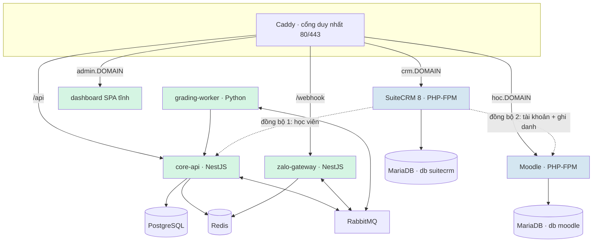

# Nền tảng ILM — hợp nhất CRM, LMS và hệ chấm bài AI

**Ngày:** 2026-09-03 · **Phiên bản:** 0.3 · **Trạng thái:** BẢN NHÁP — chờ chủ dự án duyệt, CHƯA triển khai

**Changelog v0.3 (2026-09-03, yêu cầu chủ dự án — tách nhánh để không ảnh hưởng hệ đang chạy):**

1. **Bổ sung mục 14 — chiến lược nhánh & cách ly hệ đang chạy.** Điểm cốt lõi cần nói thẳng: **nhánh git bảo vệ MÃ NGUỒN, KHÔNG bảo vệ HỆ ĐANG CHẠY.** Đây là hai cơ chế khác nhau và phải làm cả hai.
2. **Hai nhánh, không phải một.** `feature/ilm-platform` cho toàn bộ dịch vụ mới (P1/P3/P4 — thuần bổ sung), và `feature/crm-student-sync` **tách riêng** cho P2. Lý do tách: P2 là thay đổi DUY NHẤT có thể làm hỏng bot đang chạy; nếu phải lùi lại thì không muốn phải gỡ nó ra khỏi hàng tháng công việc nền tảng.

**Changelog v0.2 (2026-09-03, chủ dự án trả lời hai câu hỏi chặn):**

1. **KHÔNG CÓ CRM CŨ ĐỂ DI TRÚ.** "CRM hiện tại" chính là **Google Sheets / Excel** (V3 cũ). Đây là thay đổi lớn nhất so với v0.1: P1 chuyển từ *di trú dữ liệu có toàn vẹn tham chiếu* (rủi ro hàng tuần, không ước lượng nổi) sang **dựng mới + nhập một lần từ bảng tính**. Phần rủi ro lớn nhất của cả kế hoạch biến mất.
2. **Bài nói vẫn nộp qua Zalo** — chốt (mục 8). Moodle chỉ lo học liệu + quiz. Đường chấm bài đã nghiệm thu ngày 2026-08-25 **không bị đụng tới ở bất kỳ giai đoạn nào**.
3. **Phát sinh một câu hỏi chặn MỚI thay chỗ V3 cũ** (V3 mới, mục 10): *hiện học viên vào bảng `students` bằng cách nào?* CLAUDE.md ghi Sheets sync "cần service-account JSON thật trước khi làm được gì" — nếu thực tế nhân viên đang nhập tay qua dashboard thì việc chuyển màn Students sang chỉ-đọc ở P2 sẽ **cắt mất một quy trình nhân viên dùng hằng ngày**. Chưa xác định được từ code.
4. **Bổ sung mục 12 — nghiệm thu từng giai đoạn**, trong đó có ý quan trọng: **chạy khô bảng tính qua chính bộ kiểm tra sẵn có** của `sheets-sync.service.ts` để ra danh sách dòng bẩn TRƯỚC khi nhập vào SuiteCRM. "Câu hỏi còn mở" dời xuống mục 13.

---

Tài liệu này mở rộng phạm vi từ một bot chấm bài (`20260719-KienTrucMicroservices.md`, v1.6, đã xong M1–M4) lên một **nền tảng nhiều hệ thống** trong đó hệ chấm bài hiện tại trở thành MỘT thành phần con, không bị viết lại.

**Quyết định nền:** nền tảng là một **tập hợp dịch vụ sau chung một cổng Caddy**, mỗi hệ thống giữ nguyên công nghệ và cơ sở dữ liệu của nó, ghép với nhau bằng **đồng bộ dữ liệu một chiều** từ nguồn sự thật. KHÔNG gộp code, KHÔNG dùng chung database, KHÔNG viết lại hệ chấm bài.

**Lựa chọn đã chốt với chủ dự án (2026-09-03):**
1. **SuiteCRM 8.x** (Symfony + Angular, PHP 8.2+) — không phải 7.x LTS.
2. **Đăng nhập học viên bằng Zalo Login** — tái dùng chính tài khoản Zalo học viên đang nộp bài.
3. **Học liệu trực tuyến = LMS đầy đủ (quiz, chấm điểm, trình tự bài học)** → **triển khai Moodle**, không tự viết. Hệ quả trực tiếp: *không cần dựng thêm "portal học viên" riêng — Moodle CHÍNH LÀ trang web phục vụ học viên.*
4. **CRM hiện tại = Google Sheets / Excel** → **không có bước di trú**; SuiteCRM được dựng mới rồi nhập một lần từ bảng tính. Việc nặng còn lại là **làm sạch dữ liệu**, không phải ánh xạ quan hệ.
5. **Bài nói tiếp tục nộp qua Zalo OA**, không chuyển sang Moodle.

---

## 1. Ràng buộc bắt buộc (từ chủ dự án)

| # | Ràng buộc | Hệ quả thiết kế |
|---|---|---|
| R1 | **Không sửa app đang chạy** | Hệ chấm bài chỉ đổi ĐÚNG 1 dòng đăng ký DI (mục 5). Không đụng schema, không migration, không đổi luồng nghiệp vụ. |
| R2 | **Dữ liệu học viên & khóa học nằm ở CRM** | CRM là *nguồn sự thật*; Postgres của core-api trở thành **bản sao đọc** được đồng bộ về. Xem mục 4. |
| R3 | **Hệ chấm bài là con của nền tảng** | "Con" = dịch vụ cấp dưới, nhận dữ liệu từ trên xuống. KHÔNG có nghĩa là nhét vào SuiteCRM. |
| R4 | **Dễ mở rộng bằng Docker** | Mỗi hệ thống = một service trong `docker-compose.yml` + một subdomain trong `Caddyfile`. Thêm hệ thống mới = thêm 1 khối, không sửa khối cũ. |

**R1 và R2 xung đột trực tiếp.** Học viên/khóa học đang được đọc ở **8 chỗ** trong core-api: `onboarding.service.ts:38` (khớp SĐT), `worker-api.controller.ts:254` (lấy `course.llmConfig` cho worker), `missing-submissions.service.ts:35` (cron 20:30), `reports.service.ts:155`, `students.service.ts`, `test-upload.service.ts:35`, `courses.service.ts`, `criteria.service.ts:76`. Cắt core-api khỏi bảng `students` của nó = viết lại gần hết service, tức là vi phạm R1.

**Phán quyết:** CRM **sở hữu bản ghi**, core-api **giữ bản sao cục bộ**. Đây là cách duy nhất thỏa mãn cả R1 lẫn R2.

---

## 2. Bản đồ dịch vụ



Màu xanh lá = **đã có, không sửa**. Màu xanh dương = **xây mới**.

| Dịch vụ | Trạng thái | Ghi chú |
|---|---|---|
| `caddy` | sửa nhẹ | thêm 2 khối subdomain |
| `postgres`, `redis`, `rabbitmq` | giữ nguyên | Redis dùng chung, tách theo DB index |
| `zalo-gateway`, `grading-worker`, `dashboard` | **giữ nguyên tuyệt đối** | không một dòng nào đổi |
| `core-api` | **đổi 1 dòng** | mục 5 |
| `mariadb` | **MỚI** | MỘT instance, HAI database (`suitecrm`, `moodle`), hai user riêng |
| `suitecrm` | **MỚI** | PHP-FPM, tự build image (mục 9) |
| `moodle` | **MỚI** | PHP-FPM + cron container riêng |
| `moodle-sync` | **MỚI** | dịch vụ nhỏ đẩy CRM → Moodle (mục 6) |

**Vì sao MỘT MariaDB hai database, không phải hai instance:** tiết kiệm ~400–500MB RAM, mà cách ly ở mức database + user riêng là đủ cho hai ứng dụng cùng do mình vận hành. Nếu sau này tách VPS thì tách luôn instance.

---

## 3. Định tuyến

Dùng **subdomain, KHÔNG dùng path prefix**. SuiteCRM 8 sinh URL tuyệt đối từ `site_url` và Angular cần `base href` đúng; Moodle ghim `$CFG->wwwroot` vào session và tự chuyển hướng nếu URL không khớp. Chạy dưới subpath là chuốc lấy một lớp lỗi không đáng có.

`infra/Caddyfile` hiện có 4 khối (`/webhook*`, `/healthz`, `/api*`, SPA fallback) — **giữ nguyên**, chỉ thêm hai site block mới:

```
crm.{$DOMAIN} { reverse_proxy suitecrm:8080 }
hoc.{$DOMAIN} { reverse_proxy moodle:8080 }
```

Domain gốc vẫn phục vụ bot + dashboard như hiện tại. Thêm hệ thống thứ N sau này = thêm đúng một khối như vậy (thỏa R4).

---

## 4. Quyền sở hữu dữ liệu

Quy tắc: **mỗi trường dữ liệu có đúng MỘT nơi ghi.** Mọi nơi khác chỉ đọc bản sao.

| Dữ liệu | Nguồn sự thật | Bản sao ở đâu | Chiều |
|---|---|---|---|
| Nhân sự, giáo viên, thông tin trung tâm | **SuiteCRM** | — | — |
| Học viên (mã, họ tên, SĐT, lớp, cơ sở) | **SuiteCRM** | `core-api.students`, `moodle.user` | CRM → xuống |
| Khóa học / lớp | **SuiteCRM** | `core-api.courses`, `moodle.course` | CRM → xuống |
| Hợp đồng khóa học, thanh toán | **SuiteCRM** | — | — |
| Ghi danh (học viên ↔ lớp) | **SuiteCRM** | `moodle` enrolment | CRM → Moodle |
| Bài nộp nói, điểm AI, chi phí LLM | **core-api (Postgres)** | — | — |
| Tiêu chí chấm (rubric) | **core-api (Postgres)** | — | — |
| Học liệu, quiz, điểm quiz, tiến độ | **Moodle** | — | — |
| Liên kết Zalo ↔ học viên | **core-api (`zalo_bindings`)** | — | — |

**Điểm cần chú ý — `zalo_bindings` KHÔNG chuyển lên CRM.** Nó là kết quả của luồng ChoGan (tư vấn nhập SĐT, hệ thống khớp `students.phone`) và được grading-worker gọi trên mọi bài nộp. Đưa nó lên CRM sẽ thêm một lượt gọi mạng vào đường nóng của pipeline chấm bài, đổi lại không được gì.

---

## 5. Đồng bộ 1 — SuiteCRM → core-api (học viên)

**Đây là toàn bộ phần "đụng vào app đang chạy".**

`services/core-api/src/sheets-sync/` đã có sẵn đúng cái khớp nối cần thiết:

- `sheets-client.ts` — interface 12 dòng: `fetchRows() → SheetRow[]` với `code / fullName / phone / courseKey / className / campus`.
- `SHEETS_CLIENT_FACTORY` — DI token, vốn được tạo ra để test thay bằng client giả lập.
- `sheets-sync.service.ts` — cron 15 phút, upsert theo `code`, gom lỗi từng dòng vào `sheet_sync_log` thay vì nuốt im lặng.

**Việc phải làm:** viết `SuiteCrmStudentClient implements SheetsClient` (gọi SuiteCRM 8 V8 API, OAuth2 client-credentials), rồi đổi `sheets-sync.module.ts:10` từ `realSheetsClientFactory` sang factory mới. Thêm setting `crm.base_url` / `crm.client_id` / `crm.client_secret` vào `setting-defs.ts`.

**KHÔNG đổi:** cron, hàm `upsertRow`, cơ chế ghi log lỗi, bảng `students`, và toàn bộ 876 test của core-api.

> **`SheetRow` chính là bản đặc tả mô hình học viên tối thiểu mà SuiteCRM phải xuất ra.** Sáu trường `code / fullName / phone / courseKey / className / campus` đã được code đang chạy chứng minh là đủ cho toàn bộ nghiệp vụ hiện tại. Dựng module học viên trong SuiteCRM (P1) nên bắt đầu từ đúng sáu trường này rồi mới bổ sung, chứ không thiết kế lại từ đầu.

**Lợi ích phụ, không nhỏ:** `sheets-sync.service.ts:70` ném lỗi khi `courseKey` không khớp chính xác `courses.key`. CLAUDE.md liệt kê đây là một lớp lỗi kinh niên ("khác nhau khoảng trắng/hoa thường là hỏng tra cứu"). Dropdown của CRM bị ràng buộc giá trị, ô Excel thì không — chuyển nguồn sang CRM **xóa hẳn lớp lỗi này**, chứ không phải dời nó đi chỗ khác.

### ⚠ Bẫy phải xử lý cùng lúc

`students.service.ts` có đủ `create` / `update` / `delete`, và màn Students của dashboard đang dùng. Khi CRM thành nguồn sự thật, một chỉnh sửa của nhân viên trên dashboard sẽ **bị ghi đè âm thầm sau tối đa 15 phút** (hàm `upsertRow` ghi lại `fullName`, `phone`, `courseId`, `className`, `campus`).

Rủi ro này **đã tồn tại sẵn** với Google Sheets, nhưng đang ngủ vì Sheets chưa từng được cấu hình credential. Bật đồng bộ CRM là **đánh thức nó**.

**Xử lý:** màn Students chuyển sang **chỉ đọc**, kèm link "Sửa trong CRM". Đây là thay đổi ở dashboard (không phải app backend đang chạy), và là điều kiện bắt buộc để phát hành P2.

**Nhưng xem V3 mới ở mục 10 trước khi làm việc này** — nếu nhân viên đang nhập học viên bằng tay qua chính màn đó thì phải chuyển họ sang nhập ở CRM *trước*, không phải khóa màn rồi mới tính.

---

## 6. Đồng bộ 2 — SuiteCRM → Moodle (tài khoản + ghi danh)

Dịch vụ mới `moodle-sync`, cron định kỳ, gọi **Moodle Web Services (REST)**: `core_user_create_users`, `core_user_update_users`, `enrol_manual_enrol_users`, `core_cohort_*`.

**Vì sao là dịch vụ riêng, không phải scheduled job trong SuiteCRM:** scheduler của SuiteCRM phụ thuộc cron ngoài, khó test, và lỗi thường chỉ hiện trong log của nó. Một dịch vụ riêng thì viết test được, khớp văn hóa test sẵn có của repo, và tuân R4 (thêm/bớt = một khối compose).

**Vì sao KHÔNG dùng plugin `enrol_database` + `auth_db` của Moodle** (đọc thẳng một view SQL — ít code hơn hẳn): nó buộc Moodle mở kết nối vào database của SuiteCRM, phá vỡ nguyên tắc "mỗi DB một chủ" ở mục 4, và mọi thay đổi schema của SuiteCRM sau nâng cấp sẽ làm hỏng ghi danh mà không có thông báo.

**Nguyên tắc cấp phát:** học viên được **tạo trước từ CRM**, không tự đăng ký. Zalo Login ở mục 7 chỉ *khớp vào tài khoản đã có*, không tạo tài khoản mới — nếu không, bất kỳ ai có Zalo cũng vào được lớp học.

---

## 7. Danh tính học viên & Zalo Login

Đây là phần **thật sự mới**, và là rủi ro kỹ thuật lớn nhất còn lại của cả kế hoạch (sau khi rủi ro di trú đã biến mất ở v0.2).

Hiện tại học viên **không có tài khoản đăng nhập ở bất kỳ đâu**: Zalo chỉ cho một `user_id` ẩn danh, được khớp sang học viên qua SĐT do tư vấn nhập trong luồng ChoGan. Contact trong CRM không phải tài khoản đăng nhập.

**Hướng đi:** plugin xác thực OAuth2 cho Moodle, nhà cung cấp là Zalo. Học viên đăng nhập bằng đúng tài khoản đang dùng để nộp bài; `zalo_bindings` là nguồn phân quyền.

### Ba điểm PHẢI kiểm chứng trước khi thiết kế chi tiết

1. **Không gian ID của Zalo.** Zalo trước nay dùng ID khác nhau cho *người theo dõi OA* và *người đăng nhập ứng dụng*. Nếu hai ID không đối chiếu được thì `zalo_bindings` không dùng làm nguồn phân quyền được, và toàn bộ hướng này phải đổi. **Đây là việc đầu tiên phải làm, trước cả khi dựng Moodle.**
2. **Moodle bắt buộc có email**, unique trên mỗi user. Zalo Login nhiều khả năng không trả email. Phương án: lấy email từ CRM khi cấp phát (mục 6), Zalo chỉ dùng để *xác thực*, không dùng để *tạo* user.
3. **Plugin `auth_oauth2` sẵn có của Moodle có thể không đủ** cho Zalo (nó kỳ vọng OIDC userinfo chuẩn). Nhiều khả năng phải viết một plugin auth nhỏ bằng PHP — việc này nằm đúng trong năng lực stack mới.

**KHÔNG dùng OTP qua Zalo làm phương án dự phòng.** Chính guard cửa sổ 48h của gateway (`lib/time-window.ts`) sẽ chặn tin OTP tới bất kỳ học viên nào chưa nhắn tin gần đây — tức là hỏng đúng lúc cần nhất.

---

## 8. Ranh giới giữa HAI hệ chấm điểm

Sau khi có Moodle, hệ thống có hai bộ chấm điểm. Phân định đã **chốt**:

| | Chấm bài nói (đang có) | Quiz Moodle (mới) |
|---|---|---|
| Đầu vào | clip nói ~5 phút | câu hỏi khách quan |
| Kênh nộp | **Zalo OA — giữ nguyên (đã chốt)** | web Moodle |
| Người chấm | Gemini + giáo viên duyệt | Moodle tự chấm |
| Lưu ở | Postgres (`gradings`) | MariaDB (gradebook) |

**Chốt: kênh nộp bài nói tiếp tục là Zalo.** Bắt học viên upload file audio 5 phút từ điện thoại lên Moodle là trải nghiệm tệ hơn hẳn so với nhấn giữ nút ghi âm trong Zalo — và luồng Zalo đã nghiệm thu với API thật ngày 2026-08-25. Hệ quả: **không giai đoạn nào trong lộ trình đụng vào đường nhận bài, pipeline chấm, hay grading-worker.**

Đưa điểm AI sang gradebook Moodle là việc **giai đoạn P5**, làm sau, một chiều, và chỉ khi hai hệ đã chạy ổn riêng rẽ.

---

## 9. Hạ tầng — phần đáng lo nhất

### RAM

Stack hiện tại (7 container) đã từng **OOM-kill một jest worker** khi chạy test song song (changelog v1.5 mục 5). Nay thêm: MariaDB + SuiteCRM PHP-FPM + Moodle PHP-FPM + Moodle cron + moodle-sync.

Ước lượng thô: hiện ~2–3GB, thêm ~2.5–3.5GB → **cần tối thiểu 8GB, khuyến nghị 16GB**.

> **Việc phải làm TRƯỚC khi viết bất kỳ dòng code nào: đo RAM/CPU/disk còn trống thực tế trên VPS.** Nếu không đủ, quyết định tách VPS thứ hai cho cụm PHP phải ra *trước*, vì nó đổi hẳn phần mạng và sao lưu.

### Image Docker

**Tự viết Dockerfile từ mã nguồn phát hành chính thức** cho cả SuiteCRM lẫn Moodle. Không dùng image Bitnami: Broadcom đã siết catalog Bitnami năm 2025 và các tag miễn phí không còn đáng tin cho vận hành dài hạn. Repo này vốn đã tự build image cho cả 4 service — làm tiếp như vậy là nhất quán.

### Volume & sao lưu

Thêm `mariadbdata`, `moodledata` (file học liệu — sẽ phình to), `suitecrmupload`. Sao lưu từ nay phải phủ **hai** máy chủ CSDL và **bốn** volume, thay vì một + một như hiện tại. Cron sao lưu cần viết lại, không mở rộng cái cũ.

---

## 10. Điểm cần kiểm chứng trước khi chốt v1.0

| # | Việc | Vì sao chặn |
|---|---|---|
| V1 | Đối chiếu ID Zalo Login ↔ ID người theo dõi OA | Sai thì đổi hẳn phương án đăng nhập (mục 7). **Rủi ro kỹ thuật lớn nhất còn lại.** |
| V2 | Đo RAM/disk trống trên VPS | Sai thì đổi hẳn hình trạng hạ tầng (mục 9) |
| V3 | **Hiện học viên vào bảng `students` bằng cách nào — Sheets sync có thật sự chạy, hay nhân viên nhập tay qua dashboard?** | CLAUDE.md ghi Sheets sync cần credential "trước khi làm được gì". Nếu đang nhập tay thì việc khóa màn Students ở P2 **cắt mất quy trình hằng ngày của nhân viên** — phải chuyển họ sang nhập ở CRM trước. Không xác định được từ code, phải hỏi/xem VPS. |
| V4 | SuiteCRM 8 V8 API có trả đủ 6 trường của `SheetRow` | Thiếu trường thì phải thêm custom field trước khi viết client |
| V5 | Số lượng học viên / giáo viên thực tế | Quyết định cỡ VPS và cách cấp phát Moodle |

*(V3 của v0.1 — "CRM hiện tại là gì" — đã được trả lời: Google Sheets/Excel. Xem changelog.)*

---

## 11. Lộ trình

| Giai đoạn | Nội dung | Chạm vào app đang chạy? |
|---|---|---|
| **P0** | Kiểm chứng V1–V5. Đo VPS. **Chạy khô bảng tính** để ra danh sách dòng bẩn (mục 12). | Không |
| **P1** | MariaDB + SuiteCRM 8 lên compose, subdomain `crm.`, dựng mô hình dữ liệu (nhân sự, giáo viên, học viên, lớp, hợp đồng), **nhập một lần từ bảng tính + làm sạch dữ liệu** | Không |
| **P2** | `SuiteCrmStudentClient` + đổi 1 dòng DI + màn Students chuyển chỉ-đọc | **Có — điểm rủi ro duy nhất, chỉ 1 dòng** |
| **P3** | Moodle lên compose, subdomain `hoc.`, dịch vụ `moodle-sync` (tài khoản + ghi danh) | Không |
| **P4** | Zalo Login cho Moodle (plugin auth PHP) | Không |
| **P5** | *Tùy chọn, làm sau:* đẩy điểm AI sang gradebook Moodle | Không |

**P1 đã nhẹ đi đáng kể ở v0.2.** Không còn di trú quan hệ từ CRM cũ; việc còn lại là dựng module + nhập một lần. Phần tốn công thật sự bây giờ là **làm sạch dữ liệu bảng tính** — SĐT sai định dạng, học viên trùng, tên lớp không nhất quán — và đó là loại việc ước lượng được, khác hẳn rủi ro mở của v0.1.

---

## 12. Cách nghiệm thu từng giai đoạn

**P0 — chạy khô bảng tính, KHÔNG ghi gì.** Dùng lại đúng bộ kiểm tra đã có trong `sheets-sync.service.ts:68-70` (regex SĐT `/^0\d{9,10}$/`, `courseKey` phải tra được trong `courses`) chạy trên bảng tính hiện tại để **xuất ra danh sách dòng bẩn TRƯỚC khi nhập bất cứ thứ gì vào SuiteCRM**. Đây là bộ luật đã chạy thật trong production, không phải luật viết mới cho việc nhập liệu — dùng lại thì danh sách lỗi khớp đúng với thứ core-api sẽ từ chối sau này.

**P2 — không được làm hồi quy.**
- Bộ test core-api phải còn xanh: `docker run --rm -v "<abs>/services/core-api:/app" -w /app node:24-alpine sh -c "npm ci && npm test -- --maxWorkers=2"` (43 suite / 876 test) và `tsc` sạch.
- Test `SuiteCrmStudentClient` bằng factory trả fixture — đúng cách `sheets-sync.service.spec.ts` đang thay client Sheets.
- Đầu-cuối: tạo học viên trong SuiteCRM → kích đồng bộ → thấy dòng trong Postgres; và một `courseKey` sai phải rơi vào `sheet_sync_log`, không bị nuốt.
- **Cổng chặn phát hành:** đẩy một clip qua `/test-upload`, xác nhận vẫn dừng đúng ở `awaiting_review` và `cost_log` vẫn ghi token — đúng phép nghiệm thu đã dùng ngày 2026-08-25.

**P3:** ghi danh một học viên trong SuiteCRM → thấy tài khoản + ghi danh xuất hiện bên Moodle; và một học viên KHÔNG có trong CRM phải không tự đăng ký được.

**P4:** đăng nhập Moodle bằng Zalo với học viên đã liên kết; tài khoản Zalo chưa liên kết phải bị từ chối.

---

## 13. Câu hỏi còn mở cho chủ dự án

1. **VPS hiện tại bao nhiêu RAM?** (V2 — chặn quyết định một VPS hay hai)
2. **Học viên hiện được nhập vào hệ thống bằng cách nào?** (V3 mới — chặn P2)
3. Giáo viên có cần tài khoản ở CẢ SuiteCRM lẫn Moodle không, hay chỉ Moodle?
4. Đăng nhập một lần (SSO) cho *nhân viên* giữa SuiteCRM / Moodle / dashboard: **đề xuất hoãn.** Nhân viên chịu nhiều lần đăng nhập trong giai đoạn đầu; gộp SSO vào dự án này là cách chắc chắn nhất để nó trễ hạn.

*(Hai câu hỏi của v0.1 — CRM hiện tại là gì, và bài nói nộp ở đâu — đã được trả lời, xem changelog v0.2.)*

---

## 14. Chiến lược nhánh & cách ly hệ đang chạy

> **Điều quan trọng nhất, nói thẳng ngay: nhánh git bảo vệ MÃ NGUỒN, chứ KHÔNG bảo vệ HỆ ĐANG CHẠY.**
> Đứng ở nhánh nào không quan trọng — chạy `docker compose up -d` trên file `infra/docker-compose.yml`
> (project `name: ilm-bot`) là **tái tạo đúng những container đang phục vụ học viên**. Muốn "không
> ảnh hưởng hệ đang chạy" thì phải làm **cả hai** việc: tách nhánh (mục 14.1) *và* tách môi trường
> chạy (mục 14.2).

Kho hiện chỉ có **một nhánh `main`**, remote `origin` trên GitHub, `.env` đã nằm trong `.gitignore` (dòng 13).

### 14.1 Hai nhánh, cắt từ `main`

| Nhánh | Chứa | Vì sao riêng |
|---|---|---|
| `feature/ilm-platform` | P1, P3, P4 — MariaDB, SuiteCRM, Moodle, `moodle-sync`, plugin Zalo Login, 2 khối Caddy, Dockerfile mới | **Thuần bổ sung.** Không sửa một dòng nào của 4 service cũ. Gộp vào `main` không làm gì hỏng, vì gộp code ≠ triển khai. |
| `feature/crm-student-sync` | **CHỈ P2** — `SuiteCrmStudentClient`, 1 dòng DI ở `sheets-sync.module.ts:10`, `crm.*` trong `setting-defs.ts`, màn Students chuyển chỉ-đọc | **Đây là thay đổi DUY NHẤT chạm vào phần mềm đang chạy.** Tách ra để nếu phải lùi thì chỉ revert đúng một commit nhỏ, không phải gỡ nó khỏi hàng tháng công việc nền tảng. |

**Không dùng một nhánh dài duy nhất.** Một nhánh `platform` sống vài tháng sẽ trôi xa `main` tới mức
lần gộp cuối cùng trở thành sự kiện rủi ro nhất của cả dự án — đúng thứ mà việc tách nhánh lẽ ra
phải tránh. Mỗi giai đoạn xong thì gộp giai đoạn đó.

**Thứ tự gộp:** `feature/ilm-platform` gộp theo từng giai đoạn (P1 xong → gộp; P3 xong → gộp; P4 xong → gộp).
`feature/crm-student-sync` gộp **độc lập**, sau khi qua đủ cổng QA ở mục 12, và **chỉ khi P1 đã chạy thật**
— vì trước đó chưa có CRM nào để đồng bộ về.

### 14.2 Cách ly lúc chạy (việc khác hẳn, và quan trọng hơn)

- **Khi phát triển:** dựng cụm mới bằng **file compose riêng + project name riêng**, không sửa
  `infra/docker-compose.yml` đang phục vụ. Lưu ý Caddy hiện giữ cổng 80/443 — **không thể có hai
  Caddy trên cùng một máy**, nên cụm dev phải đổi cổng hoặc chạy ở máy khác.
- **Trên VPS:** triển khai từng giai đoạn là **hành động có chủ ý**, không phải hệ quả phụ của một
  lần `git pull`. Mỗi lần triển khai phải biết trước cách lùi.
- **Trạng thái đích** vẫn là *một* `docker-compose.yml` duy nhất chứa tất cả (mục 2) — việc tách file
  chỉ dành cho giai đoạn phát triển.

### 14.3 Kế hoạch lùi theo giai đoạn

| Giai đoạn | Cách lùi | Thời gian |
|---|---|---|
| P1, P3, P4 (dịch vụ mới) | `docker compose stop <service>` — 4 service cũ **không biết chúng tồn tại**, không có phụ thuộc ngược | tức thì |
| **P2** | Revert 1 commit (đưa `sheets-sync.module.ts:10` về `realSheetsClientFactory`) + build lại core-api | ~1 lần build |
| P5 | Ngừng job đẩy điểm; Moodle gradebook giữ dữ liệu cũ, không ảnh hưởng `gradings` | tức thì |

**P2 không có migration, không đổi schema, không đổi hợp đồng hàng đợi** — nên lùi P2 là thao tác
code thuần, không phải thao tác dữ liệu. Đây là lý do thiết kế ở mục 5 cố tình giữ thay đổi ở đúng
một dòng.

### 14.4 Bí mật — quy tắc không thương lượng

- `.env` đã gitignore. Mật khẩu MariaDB, `crm.client_secret`, token Moodle Web Services **không bao giờ vào git**.
- Trên nhánh chỉ cập nhật **`.env.example`** (tên biến, không có giá trị thật).
- Cấu hình ứng dụng đi qua dashboard → Postgres `settings` → Redis `config:*` (quyết định v1.2), **không** qua `.env` ở production.
- **Không commit thông tin app Zalo** (App ID / App Secret / OA Secret) vào bất kỳ nhánh nào.
