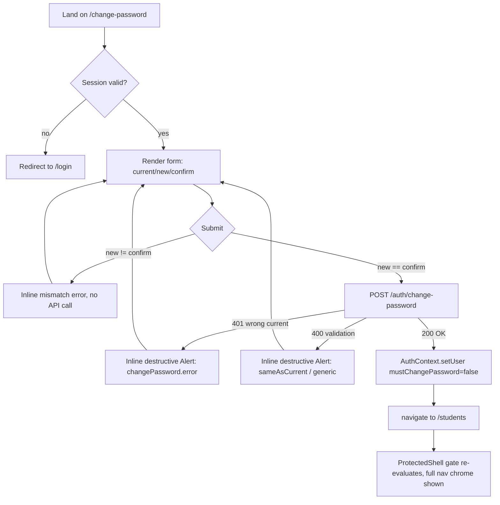

<!--
  Per-feature-per-role task file, OWNED by the UX agent.
  docs/dev-team-roles/tasks/F4-ux.md
-->

# F4 · UX — Forced password change on first login

- **Owner role:** ux
- **Feature:** F4 — design spec for the `/change-password` page (current/new/confirm password form), rendered outside `ProtectedShell`'s nav chrome like `/login`, reusing the F3 shadcn primitives and design tokens exactly.
- **Status:** DONE
- **Last updated:** 2026-07-22
- **Depends on:** `docs/dev-team-roles/tasks/F4-ba.md` (API contract, exact response/error shapes, gate precedence, i18n keys), `docs/dev-team-roles/tasks/F4-pm.md` (stories/ACs), `docs/dev-team-roles/tasks/F3-ux.md` (shipped design system — palette/typography/component inventory/Pattern A auth-screen spec), plus direct reads of `services/dashboard/src/pages/Login.tsx`, `App.tsx`, `components/ui/*`, `auth/AuthContext.tsx`, `i18n/index.ts`.

## Inputs (what this role received)

- F4-ba.md §1.3/§1.4: exact `POST /auth/change-password` contract — 200 `{email,role,mustChangePassword:false}`; 401 wrong-current-password (no DB/session write); 400 validation (`newPassword` <8 chars, or `newPassword === currentPassword`); 401 no-session (guard fires pre-handler).
- F4-ba.md §2.7–2.9: `AuthContext` gains `changePassword(currentPassword, newPassword)` action; `ProtectedShell` gate precedence (`!user` → `/login`; then `mustChangePassword` → `/change-password`; then `adminOnly` → `/students`); new page is a **sibling route of `/login`**, not wrapped in `ProtectedShell`; `Login.tsx`'s `navigate('/settings')` line stays untouched (gate supersedes it at render).
- F4-ba.md §6: exact i18n keys/copy already assigned (`changePassword.title/currentPassword/newPassword/confirmPassword/submit/mismatch/error/sameAsCurrent/success`) — reused verbatim below, not re-invented.
- F3-ux.md: Pattern A (auth screen) is the direct precedent — centered `Card max-w-sm`, `Alert variant="destructive" role="alert"` inline error, `Button` full-width submit, tokens/typography/focus-ring conventions, no loading-skeleton (matches project-wide "no spinner" convention).
- Live code: `Login.tsx` (form/error/submit pattern to mirror exactly), `App.tsx` (route registration point, `ProtectedShell` gate location), `components/ui/{alert,button,card,input,label}.tsx` (only primitives needed — no new ones), `AuthContext.tsx` (`CurrentUser` shape, action pattern).

## Checklist

- [x] Read F4-ba.md, F4-pm.md, F3-ux.md in full
- [x] Read Login.tsx, App.tsx, ui primitives, AuthContext.tsx, i18n/index.ts for exact reuse points
- [x] User flow (entry → steps → exit incl. error branches)
- [x] Wireframe: layout blocks, components, actions, states (empty/loading/error/success) for the single screen
- [x] Design spec: layout/grid, spacing, color tokens, typography, component states, responsive breakpoints (all = F3 tokens, cited not reinvented)
- [x] Field order/labels + exact i18n keys (vi+en) confirmed against F4-ba §6
- [x] Accessibility notes (labels, type=password, Enter-submit, focus management, error announcement)
- [x] Forced-vs-voluntary entry note (page stays agnostic; F5 will add a voluntary entry point)
- [x] Set Status DONE

## Outputs

### 1. User flow

```
Entry points (both land on the same route, page itself is agnostic to which):
  (a) FORCED (only entry that exists in F4): ProtectedShell gate redirects here whenever
      user.mustChangePassword === true, for ANY route the user tries to reach (including
      Login.tsx's own hardcoded navigate('/settings') after a successful login).
  (b) VOLUNTARY (not built in F4 — reserved for F5, e.g. a "Change password" link/menu
      item for an unflagged user). The page must not assume "I was forced here."

/change-password screen
  │
  ├─ Not logged in at all (no session) → AuthContext user is null/loading resolves false
  │     → page redirects to /login (same as any ProtectedShell page would; see §2 note on
  │       the unauthenticated-guard requirement from F4-ba §2.9).
  │
  ├─ Logged in, sees form: [current password] [new password] [confirm new password] [Submit]
  │     │
  │     ├─ Submit clicked, new ≠ confirm (client-side check, BEFORE any API call)
  │     │     → inline error "changePassword.mismatch" shown, focus stays in form, no request sent.
  │     │     → user edits a field → error clears on next submit attempt (mirrors Login.tsx's
  │     │       setError(null) at the top of onSubmit).
  │     │
  │     ├─ Submit clicked, new === confirm → POST /auth/change-password {currentPassword,newPassword}
  │     │     │
  │     │     ├─ 401 (wrong currentPassword) → inline destructive Alert "changePassword.error",
  │     │     │     form stays filled (only clear the two password fields that are safe to
  │     │     │     clear — see §2 Success/Error states), focus returns to "current password".
  │     │     │
  │     │     ├─ 400 (newPassword too short, or newPassword === currentPassword) → inline
  │     │     │     destructive Alert; reuse "changePassword.sameAsCurrent" when the two values
  │     │     │     are literally equal (detectable client-side too — see §2 validation note),
  │     │     │     otherwise a generic validation message is acceptable (server enforces
  │     │     │     length regardless of client checks).
  │     │     │
  │     │     ├─ 401 (session expired mid-flow, no session) → treat identically to the
  │     │     │     wrong-password case is WRONG — this is a different condition. Since
  │     │     │     SessionAuthGuard's 401 and the wrong-password 401 are not distinguished
  │     │     │     by body shape today (per F4-ba, both are plain UnauthorizedException),
  │     │     │     the page cannot reliably tell them apart from the HTTP response alone.
  │     │     │     Pragmatic behavior: show the same "changePassword.error" inline Alert;
  │     │     │     a user who is actually logged-out will simply fail again on retry and
  │     │     │     can navigate to /login manually (no crash either way — acceptable, not
  │     │     │     gated by any F4-ba AC).
  │     │     │
  │     │     └─ 200 OK {email,role,mustChangePassword:false} → AuthContext.changePassword
  │     │           calls setUser(response); component does NOT need its own navigate() logic
  │     │           beyond routing to the default landing route (/students) — ProtectedShell's
  │     │           gate re-evaluates on the new user.mustChangePassword===false and simply lets
  │     │           whatever route is requested through. Simplest implementation: after a
  │     │           successful change, call navigate('/students', { replace: true }) directly
  │     │           (mirrors Login.tsx's own explicit post-success navigate — consistent
  │     │           pattern, no reliance on an unmounted redirect race).
  │     │
  │     └─ Exit: full nav chrome now visible, no re-login required (session cookie
  │           unchanged, only req.session.user.mustChangePassword flips server-side).
```

Mermaid (equivalent, for quick reference):


### 2. Wireframe description (single screen)

**Screen: `/change-password`**

- **Goal**: let a logged-in user (forced or, later, voluntary) rotate their password by re-proving the current one, with zero nav chrome to distract a forced first-time user.
- **Layout blocks** (identical shell to `Login.tsx` — Pattern A from F3-ux.md, reused verbatim):
  1. Full-viewport centered wrapper: `<main id="main-content" className="flex min-h-screen items-center justify-center bg-background p-4">`.
  2. `Card className="w-full max-w-sm"`.
  3. `CardHeader` → `CardTitle className="text-h1"` = `t('changePassword.title')`.
  4. `CardContent` → `<form className="space-y-4">` containing, in order:
     - Field 1: **Current password** — `Label` wrapping `<span>{t('changePassword.currentPassword')}</span>` + `Input type="password" required`.
     - Field 2: **New password** — `Label` wrapping `<span>{t('changePassword.newPassword')}</span>` + `Input type="password" required minLength={8}`.
     - Field 3: **Confirm new password** — `Label` wrapping `<span>{t('changePassword.confirmPassword')}</span>` + `Input type="password" required`.
     - Conditional inline error slot (single slot, same position Login.tsx uses — between last field and submit): `Alert variant="destructive" role="alert"` containing whichever message applies (mismatch / error / sameAsCurrent).
     - `Button type="submit" className="w-full"` = `t('changePassword.submit')`.
- **Key components**: `Card`/`CardHeader`/`CardTitle`/`CardContent` (card.tsx), `Label`, `Input`, `Alert`, `Button` — all five already exist in `components/ui/`; **zero new primitives**.
- **Primary action**: Submit (`type="submit"`, triggers on Enter from any field — native form behavior, no extra wiring needed).
- **Secondary action**: none. No "cancel"/"back" control — matches PM's Non-goals (no nav chrome, forced users have nowhere else to go) and Login.tsx's own precedent (no secondary action there either).
- **States**:
  - **Empty (initial render)**: all three fields blank, no error visible, submit enabled (mirrors Login.tsx — no disabled-until-valid gating exists anywhere in this app today; keep consistent, don't introduce a new pattern here).
  - **Loading**: no dedicated loading UI (F3-ux.md §0.1 precedent: this whole app has zero loading spinners/skeletons by convention). The only concession: while the request is in flight, the submit `Button` should be `disabled` to prevent a double-submit (this is a *new*, minimal safety behavior, not present in `Login.tsx` today — acceptable since it doesn't change any redirect timing or introduce a spinner, just guards against a double-POST of a state-mutating password change, which is more consequential than a login attempt). No text changes on the button (no "Submitting…" label — keep it simple, matches project's minimal-state philosophy).
  - **Error — mismatch (client-side)**: `Alert` shows `changePassword.mismatch`; occurs before any network call.
  - **Error — wrong current password (401)**: `Alert` shows `changePassword.error`.
  - **Error — validation (400, e.g. new === current)**: `Alert` shows `changePassword.sameAsCurrent` (detect this specific case client-side too, so the more helpful message shows even before the round-trip — see §4 validation note); other 400s (e.g. too-short, which `minLength={8}`+`required` already prevent client-side in modern browsers) fall back to the same `sameAsCurrent` message or a generic one — not gated by any AC, backend's choice of exact 400 message text doesn't need surfacing since the client's own constraints should catch it first in virtually all cases.
  - **Success (200)**: no separate "success" screen/toast is required by any AC — the transition itself (navigate to `/students`, full chrome appears) *is* the success state. If Frontend wants a lightweight confirmation, `changePassword.success` exists as an i18n key for an optional toast/banner, but it is **not required** — do not block on it.

### 3. Design spec (all tokens/components below are the F3-ux.md system, cited not reinvented)

- **Layout/grid**: single-column form, no grid needed — same as Login.tsx. Card width `max-w-sm` (384px), centered via flex on a `min-h-screen` viewport wrapper.
- **Spacing**: `p-4` on the outer wrapper (mobile-safe gutter); `space-y-4` between form fields; `space-y-1` inside each `Label` between its text and input (F3-ux.md §1 density scale, reused from `Login.tsx` exactly — `className="block space-y-1"` on `Label`).
- **Color tokens**: `bg-background` (page), `Card` default (`bg-card`, `border-border`), `Alert variant="destructive"` (`--destructive`/`--destructive-foreground`, F3-ux.md §1), `Button` default variant (`bg-primary`/`text-primary-foreground`, hover `bg-primary/90`), focus ring `ring-ring` (== `--primary`). No new colors — the three error states all use the same single destructive `Alert` variant already used by `Login.tsx`; there is no separate "warning" treatment needed here (unlike Monitoring's alerts) since every branch here is a blocking validation/auth failure, not an informational heads-up.
- **Typography**: `text-h1` (24px/600) for `CardTitle`; `text-body` (14px/400) for labels/inputs/button text — exactly F3-ux.md §2's scale, no new sizes.
- **Component states** (from `components/ui/button.tsx`/`input.tsx`, already defined, just cited for completeness):
  - `Input`: default (border-input), focus (`focus-visible:ring-2 ring-ring ring-offset-2`), disabled n/a (no field is ever disabled on this screen).
  - `Button` (submit): default `bg-primary text-primary-foreground hover:bg-primary/90`; active = native `:active` browser state (no custom press state defined elsewhere in this system, stay consistent); disabled (in-flight guard, see §2 Loading) uses the existing `disabled:pointer-events-none disabled:opacity-50` from `buttonVariants` — no new variant needed, just pass the standard `disabled` prop.
  - `Alert`: single `destructive` variant, `role="alert"` (must be added explicitly — F3-ux.md §8 notes shadcn's `Alert` doesn't set this by default; `Login.tsx` already does this correctly, mirror it verbatim).
- **Responsive breakpoints**: none needed beyond what `Login.tsx` already has — the centered-card pattern is inherently responsive (flex-centered, `max-w-sm` caps width, `p-4` gives mobile gutter). No sidebar/drawer logic applies since this page renders outside `ProtectedShell` entirely (F4-ba §2.9).

### 4. Field order, labels, i18n keys (vi default / en) — confirmed against F4-ba §6, not re-invented

| Order | Field/element | i18n key | vi | en |
|---|---|---|---|---|
| 1 | Page title | `changePassword.title` | Đổi mật khẩu | Change password |
| 2 | Current password label | `changePassword.currentPassword` | Mật khẩu hiện tại | Current password |
| 3 | New password label | `changePassword.newPassword` | Mật khẩu mới | New password |
| 4 | Confirm new password label | `changePassword.confirmPassword` | Xác nhận mật khẩu mới | Confirm new password |
| 5 | Submit button | `changePassword.submit` | Đổi mật khẩu | Change password |
| — | Client mismatch error | `changePassword.mismatch` | Mật khẩu xác nhận không khớp | Passwords do not match |
| — | Server 401 wrong-current error | `changePassword.error` | Mật khẩu hiện tại không đúng | Current password is incorrect |
| — | Server 400 same-as-current error | `changePassword.sameAsCurrent` | Mật khẩu mới phải khác mật khẩu hiện tại | New password must differ from the current one |
| — | Optional success confirmation (not required) | `changePassword.success` | Đã đổi mật khẩu | Password changed |

Field types: all three inputs `type="password"` (never toggle-to-visible — no such control exists elsewhere in this app, don't introduce one). `autoComplete` attributes recommended (small, non-blocking addition, standard practice): `currentPassword` → `autoComplete="current-password"`; `newPassword`/`confirmPassword` → `autoComplete="new-password"` — helps password managers, doesn't change any behavior tested by an AC.

**Client-side validation logic** (runs on submit, before the API call):
1. If `newPassword !== confirmPassword` → show `changePassword.mismatch`, stop (no request).
2. Else if `newPassword === currentPassword` → show `changePassword.sameAsCurrent` client-side too (a nicer UX than waiting for the round-trip; the server enforces this regardless per F4-ba §1.4, so this is a redundant-but-harmless client check, not a new business rule).
3. Else → call `changePassword(currentPassword, newPassword)`; branch on resolved/rejected exactly as in §1/§2.

### 5. Forced vs. voluntary entry note

The page component itself must not read or care about *how* it was reached. F4 has exactly one entry: `ProtectedShell`'s gate (F4-ba §2.8) redirecting any authenticated, flagged user to `/change-password` regardless of target route. The page has no "why am I here" messaging, no reference to being "forced" — the title is simply `changePassword.title` ("Change password"), which reads naturally whether reached by force or by choice. F5 is expected to add a voluntary entry point (e.g., a nav/account menu link for an unflagged user) that routes to this same `/change-password` component with no prop/query-param differences required — the success transition (`navigate('/students')`) is equally correct for both cases since a voluntary changer's `mustChangePassword` was already `false` and stays `false`, so the gate never interferes either way.

### 6. Accessibility notes

- **Labelled inputs**: every `Input` wrapped in a `Label` exactly like `Login.tsx` (`<Label className="block space-y-1"><span>{text}</span><Input .../></Label>` — an implicit label association, already valid HTML/ARIA, no `htmlFor`/`id` pair needed since the input is a descendant of the `<label>`).
- **`type="password"`**: all three fields, so browsers mask input and offer no autofill-as-plaintext; `autoComplete` hints as noted in §4.
- **Enter-to-submit**: native `<form onSubmit>` handles this for free from any focused field — no `onKeyDown` handling needed, matching `Login.tsx`.
- **Focus management**: on mount, no explicit `autoFocus` is required (Login.tsx doesn't use one either — stay consistent); on a wrong-current-password (401) error, move focus back to the "current password" field (`ref.current?.focus()`) so a keyboard/screen-reader user immediately lands where they need to correct input, rather than leaving focus on the now-disabled-then-reenabled submit button.
- **Error announcement**: `Alert variant="destructive" role="alert"` — `role="alert"` makes it an ARIA live region announced automatically on mount/update by screen readers, exactly the mechanism `Login.tsx` already relies on. Only one error slot exists at a time (matches the single-slot convention used across this app per F3-ux.md), so no stacking/multiple simultaneous alerts to manage.
- **Touch targets**: `Input`/`Button` already meet the ~36-40px height convention from F3-ux.md's density scale (`h-9` buttons) — sufficient for touch, no separate mobile sizing needed since this screen has no dense table/nav to contend with.
- **Contrast**: destructive `Alert` and primary `Button` colors are the same tokens already verified AA-compliant in F3-ux.md §8 — no new pairs introduced.

## Blockers / open questions

None. F4-ba.md's contract and i18n keys are exact and sufficient; this spec adds only the presentation/state layer on top, reusing F3's shipped system without introducing any new component, token, or dependency.

## Notes for the next role

**Frontend**: build `pages/ChangePassword.tsx` as a near-copy of `Login.tsx`'s structure (same five imports: `Alert`, `Button`, `Card`/`CardContent`/`CardHeader`/`CardTitle`, `Input`, `Label`) — three password fields instead of email+password, client-side mismatch/same-as-current pre-checks before calling the new `AuthContext.changePassword` action, single `Alert role="alert"` error slot, `Button` disabled while the request is in flight (new, minimal — first disabled-submit pattern in this codebase, but justified to prevent a double password-mutation POST), `navigate('/students', { replace: true })` on success. Register the route in `App.tsz` as a sibling of `/login` (NOT inside `ProtectedShell`) per F4-ba §2.8/§2.9. Add the 9 i18n keys from §4 above to both `vi`/`en` blocks verbatim (already specified byte-for-byte in F4-ba §6, reproduced here for convenience — no new copy invented).

Handoff to Front-end: `/change-password` page — centered `Card max-w-sm` (Pattern A reuse from F3), three `type="password"` fields (current/new/confirm) each in a `Label`+`Input` pair, single `Alert variant="destructive" role="alert"` error slot cycling through `changePassword.mismatch` (client, new≠confirm) / `changePassword.error` (401 wrong current) / `changePassword.sameAsCurrent` (400/client-detected new===current), `Button` full-width submit (disabled while in-flight, the one new state beyond Login.tsx's precedent), success → `AuthContext.changePassword` resolves → `setUser` clears the flag → `navigate('/students', {replace:true})` → `ProtectedShell` gate re-evaluates and shows full chrome. Zero new components/tokens/dependencies — all five primitives (`Alert`,`Button`,`Card`,`Input`,`Label`) and all styling tokens are the F3 system already shipped. Full spec above (§1 user flow incl. mermaid, §2 wireframe/states, §3 design tokens, §4 field order + exact i18n table, §5 forced/voluntary-agnostic note, §6 accessibility).
