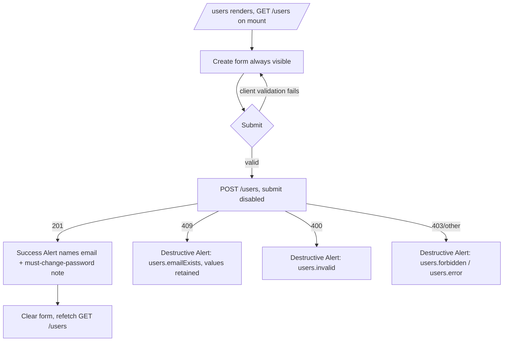

<!--
  Per-feature-per-role task file, OWNED by the UX agent.
  docs/dev-team-roles/tasks/F5-ux.md
-->

# F5 · UX — Dashboard user management (list/create/reset) + change-password entry point

- **Owner role:** ux
- **Feature:** F5 — `/users` admin screen (list, create, admin reset-password), sidebar "Change password" entry to F4's `/change-password`, and the credential-action confirmation/feedback pattern shared by both mutating flows.
- **Status:** DONE
- **Last updated:** 2026-07-22
- **Depends on:** `docs/dev-team-roles/tasks/F5-ba.md` (35 ACs, exact API contract §1, i18n keys §11, per-file inventory §8), `docs/dev-team-roles/tasks/F5-pm.md` (US1-US4), `docs/dev-team-roles/tasks/F4-ux.md` (chrome-less `/change-password` design, frozen), `docs/dev-team-roles/tasks/F3-ux.md` (design system tokens), plus direct reads of `services/dashboard/src/pages/{Students.tsx,ChangePassword.tsx}`, `App.tsx`, `components/ui/{alert,select-native,table,button,card,input,label}.tsx`, `components/icons.tsx`.

## Inputs (what this role received)

- **F5-ba.md §1** exact API: `GET/POST /users`, `POST /users/:id/reset-password`; §1.4 client error mapping is **status-only** (409→`users.emailExists`, 400→`users.invalid`, 403→`users.forbidden`, 404→`users.notFound`, other→`users.error`) — `api/client.ts` never parses response bodies, frozen.
- **F5-ba.md §8.2** per-file inventory: exactly 5 frontend files change (new `Users.tsx`; modified `App.tsx`, `icons.tsx`, `ChangePassword.tsx`, `i18n/index.ts`). `AuthContext.tsx`/`api/client.ts`/`Login.tsx`/gate body untouched.
- **F5-ba.md §11** exact i18n keys (vi+en) — reused verbatim, not re-invented.
- **F5-ba.md NFR-S9/BR-5**: own-row reset must be **omitted** (not disabled) for the acting admin, matched by `email === user.email` (`CurrentUser` has no `id`).
- **F5-ba.md FR-05**: Cancel on `/change-password` shown only when `!user.mustChangePassword`, using `state.from` (default `/students`).
- **F4-ux.md**: `/change-password` is deliberately agnostic to entry method; page stays chrome-less, outside `ProtectedShell`; only two narrowly-scoped edits permitted (post-success target, conditional Cancel).
- **F3-ux.md / live code**: `Students.tsx` list + inline-edit (`editingId`/`draft`) pattern to mirror for both create and reset; `Alert` has `default`/`warning`/`destructive` variants and never a dismiss button; `SelectNative` is the only select primitive; no Dialog/modal primitive exists in this codebase.

## Checklist

- [x] Read F5-ba.md (full, both pages), F5-pm.md, F4-ux.md, F3-ux.md summary, Students.tsx, ChangePassword.tsx, App.tsx, icons.tsx, ui primitives (select-native, alert)
- [x] `/users` screen: user flow (entry → steps → exit incl. error branches)
- [x] `/users` wireframe: goal, layout blocks, key components, actions, states (empty/loading/error/success)
- [x] Own-row reset-suppression treatment (how it reads, not "broken/arbitrary")
- [x] Sidebar "Change password" entry + Cancel-for-non-forced-only spec
- [x] Credential-action confirmation pattern (create + reset): confirm step, password-reveal-once, never logged/persisted
- [x] Form validation states, 409 duplicate-email presentation, disabled-while-submitting
- [x] Design spec: layout/grid, spacing, color tokens, typography, component states, breakpoints
- [x] Accessibility notes (contrast, touch targets, keyboard nav, labelled inputs, table semantics, focus mgmt, live-region announcements)
- [x] Confirm zero new dependency / reuse of existing `src/components/ui/*` only
- [x] Set Status DONE

## Outputs

### 0. Design system reuse (no new dependency)

Every component below is an existing primitive: `Card`/`CardHeader`/`CardTitle`/`CardContent`, `Table`/`TableHeader`/`TableBody`/`TableRow`/`TableHead`/`TableCell`, `Input`, `Label`, `Button`, `Alert` (`default`/`destructive` variants — no `warning` needed here, nothing here is advisory, every branch is either neutral info or a hard failure), `SelectNative`. No Dialog exists and none is added — confirmation is done **inline** (expand/collapse row state), exactly like `Students.tsx`'s `editingId`/`draft` pattern and F4's own no-modal precedent. Icons: reuse `IconArrowLeft` (already defined, unused) for the Cancel control; add one new icon `IconUsers` (per F5-ba §8.2, BA-authorized) following the exact `IconBase` 20x20/1.5px-stroke convention — simple two-head glyph, no library.

### 1. `/users` screen

#### 1.1 User flow

```
Entry: admin clicks "Users" (nav.users) in sidebar → /users
  (staff never sees the nav item; a staff direct-nav is bounced by ProtectedShell adminOnly → /students, per F5-ba AC-24)

/users renders
  │
  ├─ GET /users fires on mount
  │     ├─ pending → table area shows nothing extra (no spinner — project convention); create
  │     │     form is usable immediately (independent of list load)
  │     ├─ 200, items.length === 0 → table body replaced by a single-row "users.empty" message
  │     │     (rare: only possible if bootstrap admin was deleted out-of-band — cosmetic only)
  │     └─ 200, items.length > 0 → rows render, ordered createdAt asc; own row's action cell
  │           is blank/informational (see §1.3), all other rows show a "Reset password" button
  │
  ├─ CREATE flow (Card at top of page, always visible, independent of list state)
  │     1. Admin fills email / role (SelectNative: admin | staff) / initial password (≥8)
  │     2. Submit → client validation (HTML5 required + type=email + minLength=8) blocks
  │        obviously-invalid input before any request
  │     3. POST /users, submit button disabled for the duration (NFR-P2)
  │        ├─ 201 → success Alert (variant="default", role="status") naming the created
  │        │     email + "must change password at first login" (users.created, interpolated);
  │        │     all three fields cleared; GET /users re-issued; new row appears
  │        ├─ 409 → destructive Alert "users.emailExists"; form VALUES RETAINED (admin can
  │        │     just fix the email) except nothing about the password is ever redisplayed
  │        │     beyond what's already in the (still-focused) field
  │        ├─ 400 → destructive Alert "users.invalid"
  │        ├─ 403 → destructive Alert "users.forbidden" (defensive; unreachable via nav/route
  │        │     gating, kept only because the API can be hit directly)
  │        └─ other/401 → destructive Alert "users.error"
  │
  └─ RESET flow (per-row, inline, no navigation away from /users)
        1. Admin clicks "Reset password" on a row (not shown on their own row, see §1.3)
        2. Row expands into an inline edit state: one type="password" input (label
           "users.newPassword") + "Confirm reset" (primary) + "Cancel" (secondary) buttons,
           replacing the row's normal action cell (Students.tsx editingId/draft pattern)
        3a. Cancel → collapses back to normal row, zero API calls, draft discarded
        3b. Confirm reset (client minLength=8 blocks short input) → POST /users/:id/reset-
            password, confirm button disabled for the duration
              ├─ 200 → row collapses, "users.resetDone" shown as a page-level status Alert,
              │     GET /users re-issued (row's mustChangePassword now reads "yes")
              ├─ 400 → destructive Alert "users.invalid" (short password) OR, if this were
              │     ever reachable client-side (it isn't, since the action is hidden on the
              │     admin's own row), the self-reset 400 — not user-reachable from this UI
              ├─ 404 → destructive Alert "users.notFound"; GET /users re-issued (row likely
              │     disappears — user was deleted out of band)
              └─ other/401/403 → destructive Alert "users.error"
```

Mermaid (create flow, representative of both mutating flows):


#### 1.2 Wireframe description

- **Goal**: let an admin audit all dashboard accounts, mint a new one, and reset a forgotten password — all on one screen, no navigation away, mirroring `Students.tsx`'s density.
- **Layout blocks** (top to bottom, `<main id="main-content" className="space-y-6 p-6">`):
  1. `<h1 className="text-h1">{t('users.title')}</h1>`
  2. **Create card**: `Card > CardContent` containing a `<form className="space-y-4">`:
     - `Label` + `Input type="email" required` (`users.email`)
     - `Label` + `SelectNative required` (`users.role`) with two `<option>`s: `value="admin"` → `users.roleAdmin`, `value="staff"` → `users.roleStaff` ("Nhân viên (tư vấn / giáo viên)" / "Staff (advisor / teacher)")
     - `Label` + `Input type="password" minLength={8} required autoComplete="new-password"` (`users.password`)
     - single-slot feedback `Alert` (see §3 below for exact variant/role rules), positioned between the last field and the submit button — same single-slot convention as `Login.tsx`/`ChangePassword.tsx`
     - `Button type="submit" disabled={submitting}` (`users.submit`)
  3. **List card**: `Card > CardContent.overflow-x-auto.p-0 > Table`, columns in order: `users.email`, `users.role` (rendered via `t('users.role' + Admin/Staff)` mapping, not the raw enum string), `users.mustChangePassword` (rendered `common.yes`/`common.no`), `users.createdAt` (locale-formatted date), and a trailing unlabeled action `TableHead` (empty scope, matches `Students.tsx:79`).
  4. Empty state: when `data?.items.length === 0`, a single `TableRow` spanning all columns with `t('users.empty')` (`colSpan` on one `TableCell`), no illustration — matches the project's no-illustration convention (nothing elsewhere in the app uses one).
- **Key components**: `Card`, `Table` family, `Input`, `Label`, `SelectNative`, `Button`, `Alert` — zero new primitives beyond the one new icon.
- **Primary action**: Create-form submit. Per-row "Reset password" is the row-level primary action once expanded (Confirm reset).
- **Secondary actions**: per-row Cancel (during reset edit only); none on the create form (matches `ChangePassword.tsx`/`Login.tsx` precedent — no reset/clear button, the field-clearing on success is automatic).
- **States**:
  - **Empty**: table shows `users.empty` row; create form is unaffected and always usable regardless of list state.
  - **Loading**: no spinner (project-wide convention, F3-ux §0.1). List renders with whatever `data` currently is (`null` before first load → render nothing in the table body, exactly `Students.tsx`'s pattern of `data?.items.map(...)`).
  - **Error (list fetch)**: `GET /users` is admin-only and only reachable once already gated by `ProtectedShell adminOnly`, so a fetch failure here is exceptional (session dropped mid-session). No new error UI is specified — an empty table with no items is an acceptable degraded view (same as `Students.tsx` has none either); do not over-build this beyond what BA scoped.
  - **Success**: two independent single-slot Alerts — one for the create form (`users.created`), one page-level for the reset action (`users.resetDone`) OR reuse the same create-form Alert slot at the top if simpler for Frontend — **UX does not mandate two slots**, one shared status-Alert placed just under the `<h1>` (above both the create card and the table) is equally acceptable and arguably simpler; whichever the Frontend agent picks, it must remain a **single slot per concern** (create errors don't stomp on reset success and vice versa is not required — sequential actions replacing one shared slot is fine, since only one action is ever in flight at a time in this UI).

#### 1.3 Own-row reset-suppression treatment (must not look broken/arbitrary)

The acting admin's own row (matched by `email === user.email`) renders its action cell with **plain descriptive text**, not a blank cell and not a disabled-looking button (a disabled button invites "why is this disabled?" support questions). Use a muted inline note reusing an existing key rather than inventing one:

- Render `<span className="text-body text-muted-foreground">{t('nav.changePassword')}</span>` in that row's action cell — reads naturally as "(use the sidebar) Change password" in context, and doubles as a discoverability nudge toward the self-service path. This deliberately reuses `nav.changePassword` (already in the i18n set for the sidebar control) rather than requiring a new key. If Frontend/BA prefer a dedicated explanatory string, that would be a **new key not in F5-ba's list**, so the default here is the zero-new-key option.
- This row is otherwise a completely normal row (email/role/must-change/created-at render identically) — only the action cell differs. No strikethrough, no dimming of the whole row, no icon-only affordance that could be mistaken for a disabled control.

### 2. Sidebar "Change password" entry point

- **Placement**: sidebar footer, directly **above** the existing Logout `Button`, separated by nothing extra (the existing `<Separator className="my-2" />` already sits above Logout — the new control goes between that separator and Logout, both wrapped by the same footer block). Same visual treatment as Logout: `variant="ghost" className="justify-start gap-3 px-3"`, icon + `<span className="md:hidden lg:inline">` text, so it appears in both the `lg` expanded list and is reachable (as an icon-only, tooltip-labelled control) in the `md` icon-only rail — mirroring how nav `items[]` render in both modes, even though this control lives in the footer rather than `items[]`. Visible to **every** logged-in, non-forced user regardless of role (`user.mustChangePassword === false`; note the control is never rendered for a forced user anyway since a forced user never reaches `ProtectedShell`'s full chrome — the gate redirects before `SidebarNav` mounts, so no extra guard condition is needed here, this falls out of existing gate order for free).
- **Icon**: reuse `IconSettings`'s general "gear-adjacent" feel is wrong (that's taken); use a simple key/lock glyph. Since F5-ba flagged `IconKey` as optional, ship it: a minimal padlock/key outline in the same `IconBase` 20x20/1.5px style, added to `icons.tsx` alongside `IconUsers`.
- **Accessible name**: `aria-label={t('nav.changePassword')}` on the `Button` (needed for the icon-only `md` rendering; the `lg` rendering additionally shows the text label, matching Logout's exact pattern).
- **Action**: `onClick={() => navigate('/change-password', { state: { from: location.pathname } })}` — carries the current route so Cancel/post-success can return to it (FR-05).
- **Cancel affordance on `/change-password`** (shown only to non-forced users, per F4's gate having nowhere for a forced user to go):
  - Condition: render **only when `!user.mustChangePassword`**. A forced user (`mustChangePassword === true`) sees the form exactly as F4 shipped it — no Cancel, no escape, consistent with the F4 gate's intent.
  - Placement: a secondary, less prominent control **below** the submit `Button`, inside the same `<form>` — `<Button type="button" variant="outline" className="w-full" onClick={() => navigate(from ?? '/students', { replace: true })}>{t('changePassword.cancel')}</Button>`. `variant="outline"` (not `ghost`, not `default`) so it's visibly present but clearly secondary to the primary destructive-adjacent action of actually changing a credential.
  - Behavior: navigates to `location.state?.from ?? '/students'` with no request sent — matches AC-32.
  - On success, the same target (`from ?? '/students'`) is used for the post-submit `navigate(..., { replace: true })`, replacing `ChangePassword.tsx`'s current hardcoded `'/students'`.
  - **This is the only visual difference from F4's shipped page for a non-forced visitor** — no title change, no "why am I here" copy (per F4-ux §5's page-stays-agnostic ruling, preserved).

### 3. Credential-action confirmation and feedback (create + reset)

Both `POST /users` and `POST /users/:id/reset-password` mint a plaintext credential the admin must relay to someone else. Spec, common to both:

- **No modal confirmation step before submitting** — this codebase has no Dialog primitive and F5-ba's per-file inventory (§8.2) does not authorize adding one. Instead, the **submit button itself is the confirmation gesture** (labelled explicitly: `users.submit` = "Tạo/Create", `users.resetConfirm` = "Xác nhận đặt lại/Confirm reset" — the word "Confirm" is baked into the reset button's own label specifically because there's no separate confirm dialog), and the disabled-while-submitting state (NFR-P2) prevents a double-mutation from an accidental double-click.
- **Showing the admin the password so they can relay it**: the admin already knows the password — for **create**, they *typed* it into the form themselves; F5 introduces no server-generated password (BA A4). For **reset**, likewise, the admin types the new password themselves in the inline row-edit field. In both cases the success feedback (`users.created` / `users.resetDone`) deliberately does **not redisplay the password** — the admin still has it in whatever they typed it into (their own memory, a note, a password manager) since they chose it, and echoing it back a second time in the UI only increases the window it's visible on screen for no benefit. Success feedback states **who** (email) and **what happens next** (must change password at first login), not the password value itself.
- **Never logged or persisted in the UI beyond the moment of entry**: the password `Input` state is cleared from React state immediately on success (create: all three fields reset to `''`; reset: the inline draft is discarded when the row collapses). Neither value is written to `console.*`, to any client-side storage (`localStorage`/`sessionStorage`/URL), or held in any state that outlives the component's own lifecycle. This mirrors NFR-S3 on the backend and closes the loop client-side — a password must exist in exactly one place at rest: the field the admin is actively typing into, until submit clears it.
- **Failure feedback is equally explicit**: 409 tells the admin *why* nothing was created (`users.emailExists`) without needing to guess from a generic error; the retained form values (email/role/password) let them immediately correct and resubmit without retyping — this is intentional per F5-ba UC-1/E1, not an oversight, and does not conflict with "never persisted beyond the moment" since it's still the same in-flight form session, not storage.
- **Disabled-while-submitting** applies to both the create submit button and the reset confirm button (NFR-P2) — the exact same `disabled={submitting}` pattern already shipped in `ChangePassword.tsx:103`.

### 4. Form validation states (both forms)

| Field | Client check | Server check (mirrors) |
|---|---|---|
| Create: email | `type="email" required` | `@IsEmail()` → 400 `users.invalid` |
| Create: role | `SelectNative required`, only 2 options offered | `@IsIn(['admin','staff'])` → 400 `users.invalid` |
| Create: password | `type="password" minLength={8} required` | `@MinLength(8)` → 400 `users.invalid` |
| Reset: newPassword | `type="password" minLength={8} required` | `@MinLength(8)` → 400 `users.invalid` |

Validation-state visuals: rely on native HTML5 constraint validation (red browser-native outline/tooltip on invalid submit attempt) — **no custom per-field error styling is introduced**, consistent with `Login.tsx`/`ChangePassword.tsx` having none either. Only the single-slot `Alert` communicates server-side rejections. `required`/`minLength`/`type="email"` attributes are the full extent of client-side validation UI; there is no live "8/8 characters" counter or strength meter (not requested, would be new UI vocabulary the rest of the app doesn't have).

**409 duplicate-email presentation** (detailed): destructive `Alert role="alert"` immediately below the form fields (same slot as any other create error), text `t('users.emailExists')` = "Email này đã tồn tại"/"This email already exists". Focus is **not** forcibly moved (unlike `ChangePassword.tsx`'s 401 case which refocuses the current-password field) — the email `Input` the admin needs to fix is already visible and likely still focused/near-focused from typing; forcibly stealing focus back to it is unnecessary since nothing else on the page could plausibly have focus after a form-submit click. Form values remain exactly as typed so the admin can edit just the email and resubmit.

### 5. Design spec

- **Layout/grid**: single-column stacked blocks (`h1` → create `Card` → list `Card`), `space-y-6` at the page level, matching `Students.tsx` exactly. No responsive grid needed — the create form is a single narrow column (`space-y-4` between fields, same as `ChangePassword.tsx`); the table is the only element that needs horizontal scroll affordance (`overflow-x-auto` on its `CardContent`, `Students.tsx:70` precedent) below the `md` breakpoint.
- **Spacing**: `p-6` outer page padding (`Students.tsx:53`, denser page-level padding than the `p-4` used on the standalone auth-pattern screens — F3-ux's documented distinction between "app shell" pages and "centered auth" pages), `space-y-4` between form fields, `space-y-1` inside each `Label`.
- **Color tokens** (F3-ux system, no new tokens): `bg-card`/`border-border` (Card), `Alert` `default` variant (`bg-card`/`text-foreground`, used for success) and `destructive` variant (`bg-destructive/10`/`text-destructive`, used for all error branches) — **no `warning` variant here**, since nothing in this screen is advisory-only. `Button` default (`bg-primary`/`hover:bg-primary/90`) for primary submit/confirm actions; `outline` variant for Cancel and the row-level reset's own secondary Cancel.
- **Typography**: `text-h1` for the page title, `text-body` throughout (labels, table cells, buttons) — identical scale to `Students.tsx`/`ChangePassword.tsx`, no new sizes.
- **Component states**:
  - `Input`/`SelectNative`: default / focus (`ring-2 ring-ring ring-offset-2`) / disabled (n/a on this screen, no field is ever disabled — only buttons are).
  - `Button` (submit/confirm): default `bg-primary hover:bg-primary/90` / active = native `:active` / disabled (`disabled:opacity-50 disabled:pointer-events-none`, driven by `submitting` state, NFR-P2) — same as `ChangePassword.tsx:103`.
  - `Button` (Cancel/outline, reset-row and change-password Cancel): default `border-input bg-transparent hover:bg-muted` / active native / disabled n/a (Cancel is never disabled — it must always be able to back out).
  - `Alert`: `default` (success) and `destructive` (all failures) — both `role` set explicitly per §6.
  - Table row hover: none currently exists in `Students.tsx` — stay consistent, do not introduce a new hover treatment.
- **Responsive breakpoints**: identical to every other `ProtectedShell` page — sidebar collapses to icon-only rail at `md`, expands at `lg` (existing `SidebarNav` breakpoints, unmodified). The `/users` page content itself needs no additional breakpoint handling beyond the table's `overflow-x-auto`.

### 6. Accessibility notes

- **Labelled inputs**: every `Input`/`SelectNative` wrapped in a `Label` (implicit association, no `htmlFor`/`id` pairing needed — same pattern as `ChangePassword.tsx`/`Students.tsx`).
- **`type="password"`**: both the create-form password field and the inline reset field. `autoComplete="new-password"` on both (helps password managers flag these as new credentials, not login attempts).
- **Table semantics**: `TableHead scope="col"` on every header cell including the trailing action column (empty `scope="col"` header, `Students.tsx:79` precedent) — screen readers get correct column association per row.
- **Focus management**: on opening the inline reset editor, move focus into the new password `Input` (`ref.current?.focus()`) so keyboard/screen-reader users land directly in the field rather than needing to tab-hunt from wherever the "Reset password" button was; on Cancel, return focus to the row's (now-restored) "Reset password" button so focus isn't lost into the document body.
- **Error/success announcement**: `Alert role="alert"` for all destructive (error) cases so screen readers announce immediately (matches `ChangePassword.tsx`); the **success** Alert should use `role="status"` (a polite live region) rather than `role="alert"` (assertive) — success is not urgent/interruptive the way an error is, and this distinction is worth making explicit since F4's page only ever needed the destructive/assertive case.
- **Touch targets**: `Button`/`Input`/`SelectNative` are all `h-9` (36px) via the existing design system, consistent with the rest of the app — acceptable per F3-ux's prior AA sign-off; no larger targets are introduced or needed since this is a desktop-oriented admin screen (same class of screen as `Students.tsx`, `Settings.tsx`).
- **Contrast**: `destructive`/`default` Alert pairs and `primary`/`outline` Button pairs are the same tokens already verified AA-compliant in F3-ux §8 — no new color pairs introduced anywhere in this spec.
- **Keyboard nav**: entire screen is operable via Tab/Shift+Tab/Enter/Space — no custom keyboard handling needed since every control is a native `<button>`/`<input>`/`<select>`/`<form>`; Enter inside the create form submits it (native), Enter inside the reset row's password field should also submit that row's confirm action (wrap the inline reset editor in its own `<form onSubmit>`, mirroring the outer create form, rather than a bare `onClick`-only button — this also gets native Enter-to-submit for free without extra `onKeyDown` code).

## Blockers / open questions

None. F5-ba.md's contract, i18n key list, and per-file inventory are exact and sufficient. The one new i18n key surface introduced here is zero — this spec deliberately reuses `nav.changePassword` for the own-row note (§1.3) rather than requesting a new key, and defers to Frontend on the single-vs-two-Alert-slot choice (§1.2) since both satisfy every AC.

## Notes for the next role

**Frontend**: build `pages/Users.tsx` mirroring `Students.tsx`'s `load()`/`editingId`/`draft` shape (§1), a create `Card` above the list `Card`, own-row action cell rendered as a `nav.changePassword`-labelled `<span>` (§1.3, not a disabled button). Add `IconUsers` and one new `IconKey` to `icons.tsx` (§0, §2). In `App.tsx`: register `/users` route (before catch-all), add the admin-conditional `nav.users` item to `SidebarNav.items[]`, and add the sidebar-footer "Change password" `Button` above Logout with `state={{from: location.pathname}}` (§2). In `ChangePassword.tsx`: the only two edits are (a) use `useLocation().state?.from ?? '/students'` for the post-success navigate target (replacing the hardcoded `'/students'` at line 38), and (b) add the outline Cancel `Button` rendered only when `!user.mustChangePassword` (§2). Success feedback uses `role="status"`, errors use `role="alert"` (§6) — this is a small but deliberate addition beyond F4's all-`role="alert"` precedent since F4 only ever needed destructive alerts.

Handoff to Front-end: `/users` screen (admin-only, `ProtectedShell adminOnly`, `Students.tsx` list+inline-edit pattern) with a create `Card` (email/role-`SelectNative`/password fields, single-slot `Alert`, disabled-while-submitting submit) above a list `Card` (`Table` with email/role/mustChangePassword/createdAt/action columns, own-row action replaced by a `nav.changePassword`-labelled note instead of a Reset button, per-row inline reset editor with its own `<form>`, Confirm/Cancel, focus moved into the password field on open and back to the trigger button on cancel); sidebar footer "Change password" `Button` above Logout carrying `state.from`, routing into F4's frozen `/change-password` page with exactly two new conditional behaviors there (Cancel button shown only when `!user.mustChangePassword`, post-success/Cancel target = `state.from ?? '/students'`); credential-action feedback never redisplays the password value, clears form/draft state immediately on success, and uses `role="status"` for success vs `role="alert"` for errors; zero new dependencies, one new icon (`IconKey`, alongside the BA-authorized `IconUsers`), zero new i18n keys beyond F5-ba §11's list. Full spec above (§1 flow+wireframe+own-row treatment, §2 sidebar entry+Cancel, §3 confirmation/credential-display rules, §4 validation+409 presentation, §5 design tokens, §6 accessibility).
